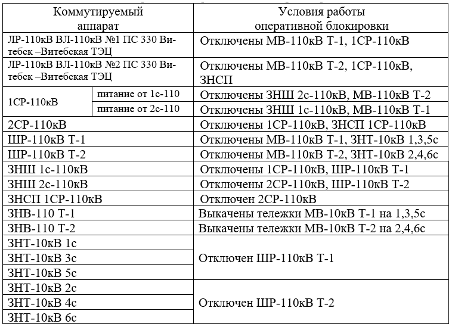
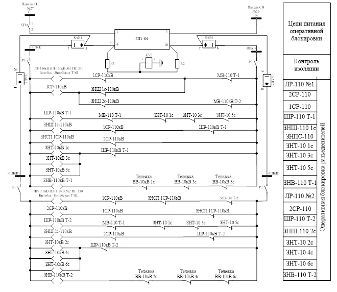

ПС Мелькомбинат
=================

ОБР
----------

:ref:`ОБР` :общие принципы работы. На ПС Мелькомбинат устройства ОБР выполнены на базе электромеханических реле.  
Аппаратура расположена в ОПУ на панели №20. 

Условия раобты ОБР
......................................................

Список сигнализации 
........................................

ОПУ: Панель №1: 

- Блинкер РУ4 "Неисправность в цепях ОБР" - замыкание на землю в цепях электромагнитной блокировки, исчезновение питания цепей блокировки от ЩСН, неисправность БПЗ-401 

Список переключающих устройств
........................................

ОПУ: Панель №20:

- Переключатель SN2 "Контроль «земли» электромагнитной блокировки" - **вверх «наличие напряжения»**, влево «изоляция полюса -», вправо «изоляция полюса +»

- Переключатель SAB1 "Электромагнитная блокировка Т-1" - **вверх «Введено»**, вправо 45 «выведено», влево 45 «выведено»

- Переключатель SAB2 "Электромагнитная блокировка Т-2" - **вверх «Введено»**, вправо 45 «выведено», влево 45 «выведено»

Список коммутационной аппаратуры
........................................

ОПУ: Панель №20:

- Автомат SF8 "Питание ОБР" - Питание и защита цепей ОБР - **Включен**.

ОПУ: Панель №28:

- Автомат SF1 - Питание БПЗ-401 от 1с-0,4кВ - **Включен**;

- Автомат SF2 - Питание БПЗ-401 от 2с-0,4кВ - **Включен**.

ОРУ-110кВ: клеммный шкаф Т-1:

- Рубильник Р1 "+ШБ Т-1" - Питание и защита цепей ОБР Т-1 - **Включен**;

- Рубильник Р2 "-ШБ Т-1" - Питание и защита цепей ОБР Т-1 - **Включен**.  

ОРУ-110кВ: клеммный шкаф Т-2:

- Рубильник Р1 "+ШБ Т-2" - Питание и защита цепей ОБР Т-2 - **Включен**;

- Рубильник Р2 "-ШБ Т-2" - Питание и защита цепей ОБР Т-2 - **Включен**.  

   