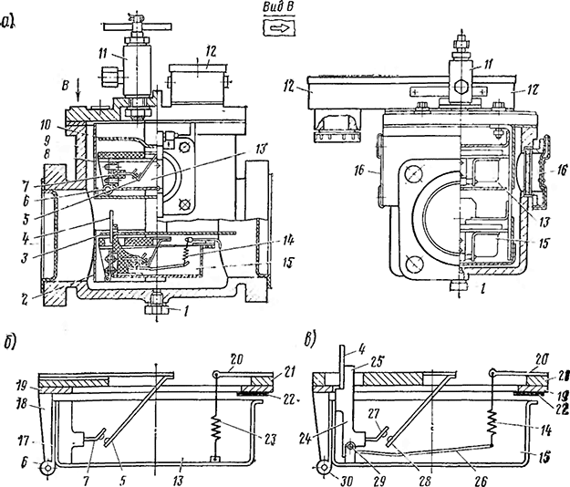
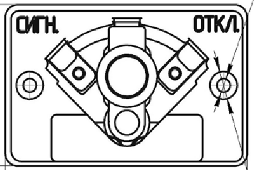
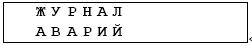
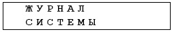
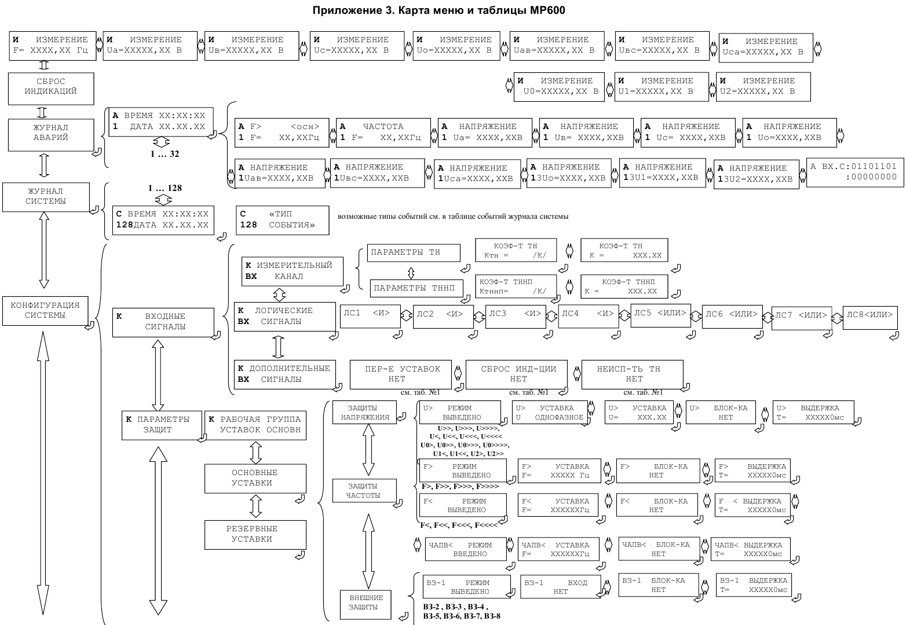
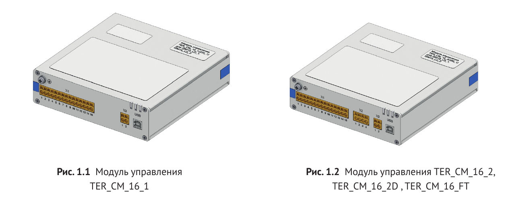
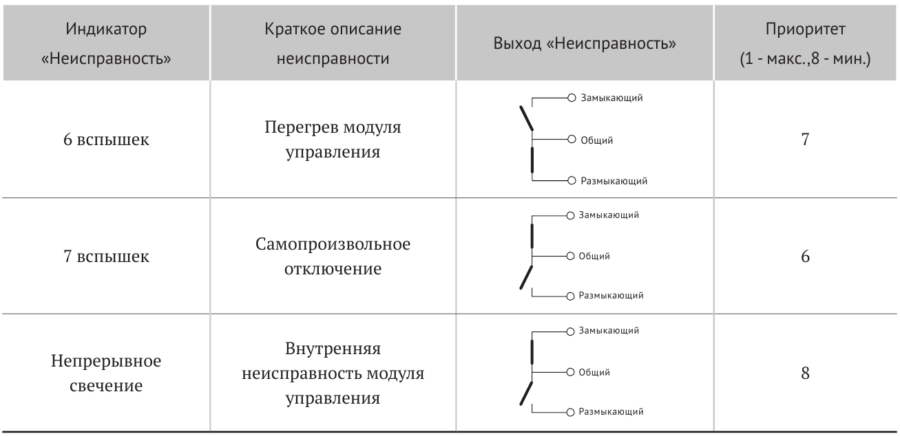
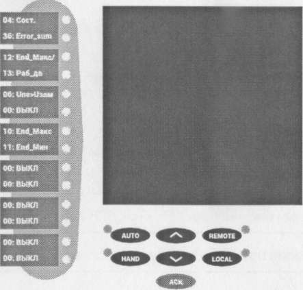

Описание порядка использования типовых устройств и блоков РЗА
=============================================================

Реле газовое РГЧЗ-66 
-------------------------------

Газовое реле РГЧЗ-66 (реле газовое чашечковое разработки 1966 г.) выпускалось Запорожским трансформаторным заводом взамен газового реле ПГЗ-22. 
Реле выполнено в соответствии с ГОСТ 10472-71 «Трансформаторы (и автотрансформаторы) силовые. Реле газовые. 
Общие технические требования». Реле РГЧЗ-66  имеет герметически закрытый корпус, практически мало отличающийся от корпуса реле ПГЗ-22. 
Фланцы реле рассчитаны на установку его в трубопроводах с внутренним диаметром 80 мм. 
В верхней части реле, с его противоположных сторон, имеются два смотровых стекла с делениями, 
позволяющими определить объем скопившегося в реле газа. Завод поставляет реле с заглушками на фланцах и крышками на смотровых стеклах, как показано на рисунке: 

а — общий вид; б — верхний (сигнальный) элемент; в — нижний (отключающий) элемент

На крышке корпуса реле установлены кран для отбора пробы газа и выпуска его из реле, а также коробка зажимов 
для подключения контрольного кабеля к сигнальному и отключающему контактам. 
На крышке реле нанесена стрелка, указывающая направление движения масла (от трансформатора к расширителю) и 
предназначенная для правильной установки выемной части реле, связанной с крышкой.

В дне коробки с зажимами имеется отверстие для стока собирающейся в ней влаги. В дне корпуса реле имеется 
пробка с резьбой для спуска влаги и грязного масла, скопившегося в нижней части реле.

На крышке корпуса с помощью стоек крепится выемная часть реле с сигнальным и отключающим элементами. 
Сигнальный элемент представляет собой плоскодонную чашку с установленным внутри нее подвижным контактом. 
Чашка с помощью изоляционной стойки поворачивается на оси, втулка которой вмонтирована в держатель чашки. 
Концы оси устанавливаются в стойках, прикрепленных к сборочному кольцу. Неподвижный контакт установлен на изолированной пластине сборочного кольца. 
Для удерживания чашки в верхнем положении, при котором сигнальный контакт разомкнут, служит спиральная пружинка, прикрепленная к держателю, установленному на сборочном кольце.

Чашка и неподвижный контакт нижнего элемента крепятся таким же способом, как и чашка и неподвижный контакт верхнего элемента реле, 
но отключающий элемент конструктивно отличается от сигнального тем, что с его чашкой связана пластина, которая должна реагировать 
на скорость потока масла в реле. Пластина и подвижный контакт нижнего элемента жестко крепятся к изоляционной стойке, к ней же крепится 
рычаг спиральной пружинки. У сигнального и отключающего элементов между сборочными кольцами и держателями спиральных пружинок имеются прокладки. 
Ось вращения пластины закреплена в скобообразной стойке, прикрепленной к дну чашки.

Для предотвращения износа алюминиевого края обеих чашек в местах касания ими упора, ограничивающего их ход, края чашек выполнены отогнутыми, 
а в месте касания каждой чашки прикреплены пластины. Без выполнения указанных мероприятий край чашки вырабатывался бы в месте касания чашкой 
упора под воздействием вибрации трансформатора и реле, что имело место в реле первых выпусков, у которых эти пластины отсутствовали. Чашка и 
пластина отключающего элемента имеют отдельные оси вращения, и при повороте вокруг своих осей и чашка и пластина действуют на замыкание отключающего контакта.

При повороте пластины вокруг своей оси чашка может и не поворачиваться, но при повороте чашки пластина поворачивается всегда, так как стенка чашки 
надавливает на выступ стойки пластины. Ход обеих чашек вниз ограничивается упорами, чем предотвращается заскакивание сигнального и отключающего контактов реле.

Оба элемента реле закрыты со стороны входного фланца реле цилиндрическими полуэкранами для защиты от механических повреждений сильным потоком масла. 
В случае замыкания отключающих или сигнальных контактов реле через имеющиеся в масле шлам или мелкие механические частицы произошла бы излишняя работа газовой защиты. 
Поэтому над чашкой сигнального элемента установлен экран для ограничения попадания в нее шлама и других механических частиц; с этой же целью над чашкой отключающего 
элемента установлен экран, в котором имеется прорезь для перемещения пластины.

В нормальных условиях работы трансформатора, когда газовое реле полностью заполнено маслом, верхняя и нижняя чашки реле удерживаются в верхнем положении так, 
что дно чашек имеет незначительный (на 5—10%) подъем со стороны расширителя. При этом оба контакта газового реле разомкнуты. Незначительное перетекание масла 
из бака трансформатора в расширитель и обратно, происходящее в процессе эксплуатации, не приводит к изменению положения сигнального и отключающего элементов реле.

При повреждении трансформатора, сопровождающемся слабым газообразованием, газ, проходящий из бака трансформатора в трубопровод расширителя, 
скапливается в верхней части корпуса реле, вытесняя масло. Когда объем газа в реле достигает 400 см3±20%, уровень масла в реле окажется ниже дна чашки сигнального элемента. 
Под воздействием силы тяжести чашки, наполненной маслом, она опускается, поворачиваясь вокруг своей оси и сигнальный контакт реле замыкается. 
Отключающий элемент реле продолжает оставаться в масле, поэтому его контакты остаются разомкнутыми. При повреждении трансформатора, 
приводящего к большим динамическим усилиям в его частях и бурному газообразованию, давление в баке резко возрастает и происходит бросок масла или смеси масла 
с газом из трансформатора в расширитель. Под воздействием потока масла (если его скорость равна или выше скорости срабатывания отключающего элемента реле) 
пластина поворачивается и отключающий контакт замыкается.

Выбор скорости срабатывания производится установкой в реле одной из трех пластин, откалиброванных на скорости 0,6; 0,9 и 1,2 м/с.

При описании конструкции указывалось, что пластина поворачивается вокруг своей оси, не приводя в движение чашку. 
Этим обстоятельством, а также расположением пластины против входного отверстия реле со стороны трансформатора достигаются 
быстрый поворот пластины вокруг своей оси и замыкание отключающего контакта реле.

Время замыкания отключающего контакта реле составляет при скорости потока масла более 1,5 его уставки 0,1—0,15 с, 
а при скорости потока масла 1,25 его уставки срабатывания не превышает 0,2 с. Время замкнутого состояния контакта при этом не менее 0,05 с, 
что позволяет осуществить надежную цепь на отключение трансформатора, хотя отключающий контакт газового реле может замыкаться и прерывисто в начальный момент повреждения трансформатора.

При описанном повреждении трансформатора сигнальный элемент реле может работать одновременно с отключающим или несколько позже, когда газ заполнит верхнюю часть корпуса реле.

При аварийной быстрой утечке масла трубопровод, соединяющий бак трансформатора с расширителем, 
и газовое реле оказываются без масла и оба элемента реле опускаются под воздействием силы тяжести чашек, 
а контакты реле действуют на отключение трансформатора и на сигнал практически одновременно.

При сквозных к. з. вблизи трансформатора происходит его сотрясение под воздействием больших токов, проходящих в его обмотках. 
Переток масла из бака трансформатора в расширитель при таких к.з. не приводит, однако, к работе газовой защиты, 
поскольку скорость потока масла не достигает скорости срабатывания реле. Следует отметить, 
что реле РГЧЗ-66 более устойчивы к вибрациям трансформатора и к сквозным к.з., чем реле ПГЗ-22. 
В соответствии с названным выше ГОСТ контакты реле РГЧЗ-66 не должны замыкаться при его значительных вибрациях (с ускорением до 5 g в диапазоне частот 20—100 Гц). 
У реле ПГЗ-22 отмечались замыкания контактов (при неизменном положении отключающего или сигнального элементов) за счет того, 
что при значительных вибрациях трансформатора или внешних механических воздействиях ртуть в контактных колбочках реле также колебалась. 
Таким образом, основными преимуществами реле РГЧЗ-66 перед реле ПГЗ-22 являются быстродействие и виброустойчивость.

BF-80/Q (Реле газовое Бухгольца)
-----------------------------------

Газовое реле Бухгольца BF-80 является важным устройством защиты и контроля для трансформаторов с жидким диэлектриком и расширителем.
Реле устанавливается в контур охлаждения контролируемого устройства и реагирует на такие нарушения, как газообразование, потери и усиление потока жидкого диэлектрика.

.. image:: media/image138.png
   :width: 4.07in
   :height: 3.0025in
 
Газовые реле Бухгольца  BF-80 имеет сигнальный и два отключающих элемента. 
Сигнальный элемент управляется шарообразным пластмассовым поплавком. 
Отключающий элемент, кроме такого же поплавка, содержит пластину , установленную поперек потока масла и маслогазовой смеси. 
Контактная система сигнального и отключающего элементов выполнена при помощи магнитоуправляемых герконов, 
замыкание которых происходит при воздействии на них постоянных магнитов, перемещаемых поплавками и поворотной пластиной. 
В отключающем элементе постоянный магнит можно установить в одном из трех положений, соответствующих уставкам скорости срабатывания 0,65-1-1,5 м/с. 
Время срабатывания реле зависит от кратности действительной скорости потока масла по отношению к уставке. 
При кратности 1,25 время срабатывания не превышает 0,15 с; при кратности 1,5 - не более 0,1 с. 

РЗТ-25 струйное реле
---------------------------------------

Реле защиты трансформатора РЗТ-25 является защитным реле для изолированных или охлаждаемых жидкостью аппаратов с расширительным сосудом 
(трансформаторы, многоступенчатые переключатели, конденсаторы, дроссельные катушки и т.д.) и монтируется на соединительном трубопроводе между корпусом и расширительным сосудом.
Струйное реле типа РЗТ-25 предназначено для коммутации сигнала «ОТКЛЮЧЕНИЕ» в случае превышения скорости жидкости в соединительном трубопроводе выше заданного порогового значения. 
Реле имеет механический фиксатор замкнутого состояния контактов.

.. image:: media/image139.png
   :width: 3.07in
   :height: 4.0025in

Работоспособность реле проверяется нажатием контрольной кнопки, которая при движении вниз утапливает последовательно верхний, а потом нижний поплавки, 
вызывая принудительную коммутацию сигналов «Предупреждение» и «Отключение». После отпуская кнопки под действием пружины система возвращается в исходное состояние. 
У реле РЗТ–25 фиксатор-защелка срабатывает в момент коммутации в сигнале «ОТКЛЮЧЕНИЕ» и не позволяет системе вернуться в исходное состояние. 
Для сброса сигнала «ОТКЛЮЧЕНИЕ» необходимо повторное нажатие на контрольную кнопку.

Аналогами реле РЗТ-25 являются реле типа: РСТ-25, РГТ-25, URF-25 (реле Бухгольца).

Реле РЗТ поставляется потребителю с установленным, в соответствии с заказом, порогом срабатывания по скорости потока масла и замыкающимися контактами. 
При отсутствии в заказе указаний о пороге срабатывания реле поставляется с настройкой 1 м/с.

При необходимости изменения порога срабатывания по скорости потока масла, реле вскрывается, и установка порога срабатывания производится за счет изменения 
положения подвижной шторки, частично перекрывающей проходное окно в экране.

Накладка НКР-1
-------------------------------

Накладка НКР-3 предназначена для неавтоматических переключений без тока 
цепей защиты станций и подстанций с номинальным током до 10А и 
номинальным напряжением до 380 В переменного тока 50 Гц и до 220 В 
постоянного тока. Используются в цепях релейной защиты и автоматики в 
качестве вспомогательного устройства. Конструкция Накладки НКР-3 позволяет 
организовать точку подключения электрической схемы с видимым разрывом, 
что значительно облегчает обслуживание и наладку оперативных цепей. 

Накладка НКР-3 позволяет осуществлять переключение электрических цепей 
и имеет 3 фиксированных положения. Основной частью изделия является 
корпус на котором смонтированы три неподвижныч вывода. На лицевой стороне корпуса 
напротив левого контакта нанесена рельефная надпись "Сигн.", напротив 
правого -"Откл.". Центральный контакт не маркирован.

Все переключения между контактами из одного положения в другое производятся 
только при отключенном токе и осуществляются в следующей 
последовательности: ручка отвинчивается против часовой стелки до упора, 
при этом пружина разводит зажим и контакт, между этими деталями образуется зазор 
около  3 мм. Далее удерживая за ручку проворачиваем ее в положение 
"Сигн". Для соединения подвижного узла вращаем ручку по часовой стрелке, зажим и 
контакт стягиваются и зажимают своими контактными поверхностями 
отогнутую полку вывода с одной стороны. Переключение между выводами в положение 
"Откл." производятся в такой же последовательности. 

Реле указательное РУ-1
------------------------

Реле указательные РУ-1 предназначены для сигнализации аварийного состояния в цепях 
постоянного и переменного тока. 
Реле РУ-1 представляет собой реле блинкерного типа с электромагнитным приводом и 
ручным возвратом. В исходное положение реле устанавливается нажатием кнопки указателя 
срабатывания. При этом окно индикации реле РУ-1 имеет серебристо-белый цвет,  
замыкающие контакты разомкнуты, а размыкающие - замкнуты.
При подаче на обмотку реле РУ-1 питающего напряжения (тока) указатель срабатывания 
изменяет цвет окна индикации на красный, являющийся индикатором срабатывания реле. 
При снятии питания с обмотки реле указатель срабатывания и контакты остаются в том же положении.

.. image:: media/image135.png
   :width: 1.99833in
   :height: 3.0625in

Реле указательное РЭУ-11
-------------------------

Реле указательные РЭУ-11 предназначены для сигнализации аварийного состояния в цепях постоянного 
и переменного тока.В исходное положение реле РЭУ-11 устанавливается нажатием кнопки указателя срабатывания. 
При этом окно индикации реле РЭУ-11 имеет серебристо-белый цвет.При подаче на обмотку напряжения (тока) якорь 
притягивается к электромагниту, освобождая фиксатор, кнопка перемещается под действием пружины, пластины кнопки 
индикации входят в пазы между призмами крышки индикатора, засвечивая окна индикации в красный цвет.
При снятии питания с обмотки указатель срабатывания и контакты без самовозврата остаются в том же положении.

+------------------------------------+------------------------------------+
| .. image:: media/image132.png      | .. image:: media/image133.png      |
|    :width: 1.99833in               |    :width: 3.05833in               |
|    :height: 3.0625in               |    :height: 3.0625in               |
+------------------------------------+------------------------------------+

Реле указательное РУ-21
------------------------

Реле указательные серии РУ-21 предназначены для использования в схемах устройств 
релейной защиты и автоматики энергетических систем в цепях постоянного и переменного 
тока частоты 50 Гц в качестве указателя действия. Реле   облегчают анализ действия 
защит и, тем самым, способствуют ускорению ликвидации повреждений.

+------------------------------------+------------------------------------+
| .. image:: media/image129.png      | .. image:: media/image130.png      |
|    :width: 3.35833in               |    :width: 3.05833in               |
|    :height: 3.0625in               |    :height: 3.0625in               |
+------------------------------------+------------------------------------+

Общий вид реле РУ-21 приведен на рисунке 3. Действие реле серии РУ-21 основано на
электромагнитном принципе. При подаче напряжения или   тока (в зависимости от исполнения)
на катушку, якорь притягивается к сердечнику и освобождает упор флажка. Флажок имеет 
чередующиеся белые и черные сектора. При освобождении упора флажок поворачивается под
действием грузика и белые сектора появляются в смотровых окнах скобы, окрашенной в черный
цвет. Одновременно с поворотом флажка поворачивается  сблокированный с ним  изоляционный 
барабанчик с контактными мостиками, которые замыкают (или размыкают) неподвижные контакты. 
При обесточивании катушки якорь возвращается в исходное положение под действием возвратной
пружины, а флажок с контактными мостиками остается в сработанном положении.

.. _МР-300:

МР-300
--------------

При подаче питания на МР-300 загорается жидкокристаллический индикатор
(ЖКИ) и появляется первый кадр меню.

Основным элементом отображения является жидкокристаллический
буквенно-цифровой индикатор ЖКИ (дисплей), содержащий две строки по 16
символов. Информация, которую можно вывести на дисплей, разбита на кадры
с фиксированным содержанием. Поочередный просмотр кадров осуществляется
с помощью кнопок. Очередность смены кадров на дисплее определяется
главным меню и подменю (см. приложение 1).

В "дежурном" режиме работы подсветка ЖКИ погашена и отображается первый
кадр меню. При нажатии на любую кнопку подсветка включается. Если ни
одна кнопка не нажимается в течение 3 мин., подсветка гаснет и
устройство переходит в "дежурный" режим.

.. image:: media/image1.png
   :width: 4.95833in
   :height: 5.0625in

Дополнительно на пяти единичных индикаторах (в дальнейшем - светодиодах)
индицируется:

"ЗАЩИТА" – произошло срабатывание защиты;

"ЗЕМЛЯ" – произошло срабатывание защиты от замыканий на землю;

"ВКЛ" – выключатель включен;

"ОТКЛ" – выключатель отключен;

"КОНТР" – неисправность устройства или выключателя.

Кнопки управления, расположенные на терминале защит, выполняют следующие
функции:

+-----------------------------+-------------------------------------------+
|.. image:: media/image2.png  |- перемещение по окнам меню **вверх**      |
|  :width: 0.65417in          |  или увеличение значения уставки;         |
|  :height: 0.65625in         |                                           |
+-----------------------------+-------------------------------------------+
|.. image:: media/image3.png  |- перемещение по окнам меню **вниз**       |
|  :width: 0.60417in          |  или уменьшение значения уставки;         |
|  :height: 0.65625in         |                                           |
+-----------------------------+-------------------------------------------+
|.. image:: media/image4.png  |- перемещение по окнам меню **влево**      |
|  :width: 0.60417in          |  или перемещение курсоравлево;            |
|  :height: 0.65625in         |                                           |
+-----------------------------+-------------------------------------------+
|.. image:: media/image5.png  |- перемещение по окнам меню **вправо**     |
|  :width: 0.60417in          |  или перемещение курсора вправо;          |
|  :height: 0.65625in         |                                           |
+-----------------------------+-------------------------------------------+
|.. image:: media/image6.png  | ВВОД – ввод значения, вход в подменю или  |
|  :width: 0.60417in          | в режиме изменения параметра (11);        |
|  :height: 0.65625in         |                                           |
+-----------------------------+-------------------------------------------+
|.. image:: media/image7.png  | СБРОС – сброс ввода уставки или переход в |
|  :width: 0.60417in          | вышестоящее подменю (10);                 |
|  :height: 0.65625in         |                                           |
+-----------------------------+-------------------------------------------+

Меню защиты имеет древовидную структуру. С помощью ЖКИ пользователь
имеет возможность прочитать следующую информацию, расположенную в
различных подменю:

1. Текущие значения токов в фазах и тока замыкания на землю;

2. Параметры журнала системы, который включает в себя 32
последовательных во времени сообщения о неисправностях в системе защиты
линии;

3. Параметры журнала аварий, который включает в себя:

- дату, время повреждения;

- сработавшую ступень;

- вид повреждения;

- максимальный ток повреждения;

- токи соответствующих фаз в момент срабатывания защиты;

- состояние устройств автоматики (АПВ, УРОВ);

4. Коэффициенты трансформации фазных трансформаторов тока (ТТ) и
трансформатора нулевой последовательности (ТНП);

5. Информацию обо всех подключённых ступенях и текущих уставках;

6. Параметры автоматики защит: ускорение, АПВ, УРОВ, внешние защиты (1 и 2);

7. Параметры системы.

Для удобства работы пользователя при выводе информации на ЖКИ в левой
части экрана выводятся подсказки в виде букв, обозначающих
местонахождение в меню пользователя.

Расшифровка букв происходит следующим образом:

-  верхняя строка:

**И** - меню измерений;

**У** - меню учёта энергии;

**С** - меню журнала системы;

**А** - меню журнала аварий;

**К** - меню конфигурации системы;

-  нижняя строка:

**А** - подменю параметров автоматики;

**И** - подменю измерительного канала;

**З** - подменю параметров защит;

**Э** - подменю параметров энергоучёта;

**С** - подменю параметров системы.

**Цифры** – порядковый номер события при просмотре журнала. Номера
событий присваиваются в обратном порядке, то есть с № 1 будет храниться
последнее событие.

Для удобства просмотра параметров, пользователь может просмотреть
содержание пунктов меню, удерживая выбранную им клавишу. При этом на
экране ЖКИ циклически высветятся имеющиеся параметры в выбранном пункте.

Просмотр значений токов в фазах и тока замыкания на землю осуществляется
в меню «измерений». Заголовок данного меню является первым кадром и
отображает значение тока в фазе А. Просмотр остальных значений
осуществляется перемещением из первого кадра согласно структуре меню
(Приложение 4). Значения токов отображаются с учётом коэффициента
трансформации трансформаторов тока, т. е. показываются реальные величины
токов в линии.

.. image:: media/image8.png
   :width: 2.65625in
   :height: 0.53125in

Текущее значение тока фазы А (В, С) и токов 3Iо, 3Iг, 3I1, 3I2, 3I0,
где:

3Io – основная гармоника тока нулевой последовательности;

3Iг – 11-я гармоника тока нулевой последовательности;

3I1 – расчетный ток прямой последовательности;

3I2 – расчетный ток обратной последовательности;

3I0 – расчетный ток нулевой последовательности.

При обнаружении аварии на защищаемой линии устройство сохраняет
информацию о дате и времени аварии, сработавшей ступени, виде
повреждения и максимальном токе повреждения, автоматически делая запись
в журнале аварий. В журнале может храниться до 16 аварий. При превышении
этого числа, каждая новая авария будет записываться на место самой
старой аварии.

Для просмотра параметров аварий необходимо войти в меню:

На дисплее отобразится заголовок аварии с датой, временем и номером
аварии (отсчет ведется от последней аварии). Расшифровка символов
журнала аварий представлена в таблице №4.

Для просмотра журнала системы необходимо войти в меню:

На дисплее отобразится заголовок события с датой, временем и порядковым
номером. Нажатием соответствующих кнопок просмотреть сообщение. Журнал
системы содержит сообщения о событиях в системе, таких, как:
неисправности, включение и отключение выключателя и т.д. При
возникновении события устройство сохраняет в журнале информацию о дате и
времени аварии.

Во время работы устройство проводит самодиагностику, если при этом
обнаружены неисправности модулей, то программа перейдет в
соответствующее окно диагностики.

6. Подменю «ПАРАМЕТРЫ СИСТЕМЫ».

В данном подменю производится установка текущих даты и времени,
параметров связи и параметров управления.

+----------------------------+--------------------------------------------------+
|.. image:: media/image92.png|   Вход в подменю.                                |  
|    :width: 2.14792in       +--------------------------------------------------+
|    :height: 3.09792in      |   Установка даты/времени.                        |
|                            +--------------------------------------------------+
|                            |   Установка параметров связи.                    |
+----------------------------+--------------------------------------------------+

6.1 Просмотр и установка реального времени

+----------------------------+--------------------------------------------------+
|.. image:: media/image93.png|   Просмотр часов.                                |
|    :width: 2.14792in       +--------------------------------------------------+
|    :height: 3.80792in      |   Вход в режим корректировки часов.              |
|                            +--------------------------------------------------+  
|                            |   Ввод пароля для корректировки часов.           |
|                            +--------------------------------------------------+
|                            |   Установка – числа, месяца, года.               |
|                            +--------------------------------------------------+
|                            |   Установка – часы, минуты, секунды.             |
+----------------------------+--------------------------------------------------+

.. image:: media/image124.png
   :width: 9.63542in
   :height: 6.72917in

.. image:: media/image125.png
   :width: 9.63542in
   :height: 6.72917in

.. _МР-301:

МР-301
--------------

При подаче питания на МР-301 загорается
жидкокристаллический индикатор (ЖКИ) и появляется первый кадр меню.

Основным элементом отображения является жидкокристаллический
буквенно-цифровой индикатор ЖКИ (дисплей), содержащий две строки по 16
символов. Информация, которую можно вывести на дисплей, разбита на кадры
с фиксированным содержанием. Поочередный просмотр кадров осуществляется
с помощью кнопок. Очередность смены кадров на дисплее определяется
главным меню и подменю (см. приложение 1).

В "дежурном" режиме работы подсветка ЖКИ погашена и отображается первый
кадр меню. При нажатии на любую кнопку подсветка включается. Если ни
одна кнопка не нажимается в течение 3 мин., подсветка гаснет и
устройство переходит в "дежурный" режим.

.. image:: media/image13.png
   :width: 4.58333in
   :height: 4.16667in

На терминале МР-301:

Дополнительно на единичных индикаторах (в дальнейшем - светодиодах)
индицируется:

1. ВКЛЮЧЕНО (красный) выключатель включен

2. ОТКЛЮЧЕНО (зеленый) выключатель отключен

3. АВАРИЯ (красный) - есть новая запись в журнале аварий, произошло
срабатывание защиты

4. КОНТРОЛЬ (желтый) - есть новая запись о неисправности в журнале
системы, возможна неисправность

5. 4 свободно программируемых светодиода (зеленый)

+-----------------------------+-------------------------------------------------------------------+
|.. image:: media/image14.png | – сброс ввода уставки или переход в вышестоящее подменю;          |
+-----------------------------+-------------------------------------------------------------------+
|.. image:: media/image15.png | – ввод значения, вход в подменю или в режим изменения параметра;  |
+-----------------------------+-------------------------------------------------------------------+
|.. image:: media/image16.png | – перемещение по окнам меню вверх или увеличение значения уставки;|
+-----------------------------+-------------------------------------------------------------------+
|.. image:: media/image17.png | – перемещение по окнам меню вправо или перемещение курсора вправо;|
+-----------------------------+-------------------------------------------------------------------+
|.. image:: media/image18.png | – перемещение по окнам меню влево или перемещение курсора влево;  |
+-----------------------------+-------------------------------------------------------------------+
|.. image:: media/image19.png | – перемещение по окнам меню вниз или уменьшение значения уставки. |
+-----------------------------+-------------------------------------------------------------------+

Для удобства просмотра параметров, пользователь может просмотреть
содержание пунктов меню, удерживая выбранную им клавишу. При этом на
экране ЖКИ циклически высветятся имеющиеся параметры в выбранном пункте.
Если пользователь при просмотре или изменении параметров не нажимает на
кнопки в течение трех минут, то устройство автоматически переходит в
«дежурный» режим, при этом автоматически запрещается режим изменения
уставок. Для проведения изменений необходимо заново повторить все
действия по вхождению в подменю и изменению значений

3 Просмотр текущих значений, измеренных величин.

Просмотр значений измеренных величин осуществляется в меню «ИЗМЕРЕНИЕ».
Заголовок данного меню является первым кадром и отображает значение тока
в фазе А. Значения токов и напряжений отображаются с учётом коэффициента
трансформации трансформаторов тока и трансформаторов напряжений, т. е.
показываются реальные величины измеренных величин.

Текущее значение тока фазы А (В, С) и токов Iо, Iг, I1, I2, I0, где

Io – основная гармоника тока (нулевой последовательности), измеренного
по четвёртому каналу тока;

Iг – высшая гармоника тока (нулевой последовательности), измеренного по
четвёртому каналу тока;

I1 – расчетный ток прямой последовательности;

I2 –расчетный ток обратной последовательности;

I0 – расчетный ток нулевой последовательности.

4 Сброс индикации

Для сброса индикации необходимо войти в меню:

.. image:: media/image78.png   
   :width: 2.09375in
   :height: 0.61458in          

.. image:: media/image79.png   
   :width: 0.61458in
   :height: 0.61458in           

После сброса индикации, т.е. нажатия «ВВОД», выводится сообщение о
выполнении сброса.

5 Журналы

+----------------------------+------------------------------+
|.. image:: media/image80.png|   Просмотр журнала аварий.   |
|    :width: 2.09375in       +------------------------------+                            
|    :height: 2.11833in      |   Просмотр журнала системы.  |  
+----------------------------+------------------------------+         
|.. image:: media/image81.png|   Просмотр меню статистики.  |
|    :width: 2.09375in       +------------------------------+  
|    :height: 2.11833in      |   Сброс журналов             | 
+----------------------------+------------------------------+ 

5.1. Просмотр журнала аварий.

При обнаружении аварии на защищаемой линии устройство сохраняет
информацию о дате и времени аварии, сработавшей ступени, виде
повреждения и максимальном токе повреждения, автоматически делая запись
в журнале аварий.

В журнале может храниться до 32 аварий. При превышении этого числа,
каждая новая авария будет записываться на место самой старой аварии.

Расшифровка индицируемых видов повреждения защищаемой линии:

\_ABC Трёхфазное КЗ на землю;

АВС Трёхфазное КЗ;

AC Двухфазное КЗ между фазами A и C;

\_AC Двойное КЗ на землю между фазами A и C;

AB Двухфазное КЗ между фазами A и B;

\_AB Двойное КЗ на землю между фазами A и B;

BC Двухфазное КЗ между фазами B и C;

\_ BC Двойное КЗ на землю между фазами B и C.

Для просмотра параметров аварий необходимо войти в меню:

.. image:: media/image82.png
   :width: 2.42708in
   :height: 0.84375in

На дисплее отобразится заголовок аварии с датой, временем и номером
аварии (отсчет ведется от последней аварии).

.. table::"Содержание журнала по выбранной аварии"
   :class: longtable

+------------------------------+--------------------------------------+
| .. image:: media/image83.png |                                      |
|    :width: 2.09375in         | Последняя авария.                    |
|    :height: 2.90833in        |                                      |
|                              +--------------------------------------+
|                              |                                      |
|                              | Самая «старая» авария.               |
|                              |                                      |
+------------------------------+--------------------------------------+
| .. image:: media/image84.png | Типы сообщений журнала аварий:       |
|    :width: 2.09375in         |                                      |
|    :height: 1.45833in        | «ЖУРНАЛ ПУСТ» - нет сообщений в      |
|                              | журнале; «СИГНАЛИЗАЦИЯ» - работа     |
|                              | защиты в схему сигнализации;         |
|                              |                                      |
|                              | «ОТКЛЮЧЕНИЕ» - работа защиты на      |
|                              | отключение выключателя;              |
|                              |                                      |
|                              | «РАБОТА» - сработала ступень защиты, |
|                              | работа на отключение блокирована     |
|                              | другой ступенью (сработавшей ранее); |
|                              |                                      |
|                              | «НЕУСПЕШНОЕ АПВ» - произошло         |
|                              | отключение защитами после АПВ;       |
|                              |                                      |
|                              | «ВОЗВРАТ» - произошло АПВ по         |
|                              | возврату;                            |
|                              |                                      |
|                              | «ВКЛЮЧЕНИЕ»-включение.               |
+------------------------------+--------------------------------------+
| .. image:: media/image85.png | Сработавшая ступень защиты, вид      |
|    :width: 2.09375in         | повреждения, группа уставок.         |
|    :height: 1.45833in        | Максимальное (для максимальных       |
+------------------------------+ защит) или минимальное (для          |
|                              | минимальных защит) значение          |
|                              | контролируемого параметра за время с |
|                              | момента превышения уставки до        |
|                              | срабатывания защиты.                 |
|                              |                                      |
|                              +--------------------------------------+
|                              | Ток фазы А в момент аварии.          |
| .. image:: media/image117.png|                                      |
|    :width: 2.19417in         +--------------------------------------+
|    :height: 5.33333in        | Ток фазы В в момент аварии.          |
|                              |                                      |
|                              +--------------------------------------+
|                              | Ток фазы С в момент аварии.          |
|                              |                                      |
|                              +--------------------------------------+
|                              | Расчётный ток нулевой                |
|                              | последовательности в момент аварии.  |
|                              |                                      |
|                              +--------------------------------------+
|                              | Расчетный ток прямой                 |
|                              | последовательности в момент аварии.  |
|                              |                                      |
|                              +--------------------------------------+
|                              | Расчетный ток обратной               |
|                              | последовательности в момент аварии.  |
+------------------------------+--------------------------------------+
|                              | Измеренный ток (нулевой              |
| .. image:: media/image118.png| последовательности) по четвёртому    |
|    :width: 2.19417in         | каналу тока в момент аварии.         |
|    :height: 1.93333in        |                                      |
|                              +--------------------------------------+
|                              | Ток высшей гармоники (нулевой        |
|                              | последовательности), измеренный по   |
|                              | четвёртому каналу тока в момент      |
|                              | аварии.                              |
+------------------------------+--------------------------------------+
|                              | Состояния дискретных входов Д1-Д8 в  |
| .. image:: media/image119.png| момент аварии.                       |
|    :width: 2.19417in         |                                      |
|    :height: 1.83333in        +--------------------------------------+
|                              | Состояния дискретных входов Д9-Д16 в |
|                              | момент аварии.                       |
+------------------------------+--------------------------------------+

5.2 Просмотр журнала системы.

Для просмотра журнала войти в меню:

.. image:: media/image89.png
   :width: 2.21875in
   :height: 0.89958in

На дисплее отобразится заголовок события с датой, временем и порядковым
номером. Нажатием соответствующих кнопок просмотреть сообщение. Журнал
системы содержит до 128 сообщений о событиях в системе, таких, как:
неисправности, включение и отключение выключателя и т.д.

При возникновении события устройство сохраняет в журнале информацию о
дате и времени сообщения о событии.

+------------------------------+--------------------------------------------------+
| .. image:: media/image90.png | Последнее сообщение. По нажатию кнопки «ВПРАВО»  |
|    :width: 2.14792in         | выполняется переход к тексту сообщения.          |
|    :height: 2.29792in        |                                                  |
|                              +--------------------------------------------------+
|                              | .. image:: media/image91.png                     |
|                              |    :width: 2.44792in                             |
|                              |    :height: 0.69792in                            |
+------------------------------+--------------------------------------------------+

6. Подменю «ПАРАМЕТРЫ СИСТЕМЫ».

В данном подменю производится установка текущих даты и времени,
параметров связи и параметров управления.

+----------------------------+--------------------------------------------------+
|.. image:: media/image92.png|   Вход в подменю.                                |  
|    :width: 2.14792in       +--------------------------------------------------+
|    :height: 3.09792in      |   Установка даты/времени.                        |
|                            +--------------------------------------------------+
|                            |   Установка параметров связи.                    |
+----------------------------+--------------------------------------------------+

6.1 Просмотр и установка реального времени

+----------------------------+--------------------------------------------------+
|.. image:: media/image93.png|   Просмотр часов.                                |
|    :width: 2.14792in       +--------------------------------------------------+
|    :height: 3.80792in      |   Вход в режим корректировки часов.              |
|                            +--------------------------------------------------+  
|                            |   Ввод пароля для корректировки часов.           |
|                            +--------------------------------------------------+
|                            |   Установка – числа, месяца, года.               |
|                            +--------------------------------------------------+
|                            |   Установка –часы, минуты, секунды.              |
+----------------------------+--------------------------------------------------+

.. image:: media/image127.png
   :width: 9.63542in
   :height: 6.72917in

.. _МР-500:

МР-500
--------------

При подаче питания на МР-500 загорается жидкокристаллический индикатор
(ЖКИ) и появляется первый кадр меню.

Основным элементом отображения является жидкокристаллический
буквенно-цифровой индикатор ЖКИ (дисплей), содержащий две строки по 16
символов. Информация, которую можно вывести на дисплей, разбита на кадры
с фиксированным содержанием. Поочередный просмотр кадров осуществляется
с помощью кнопок. Очередность смены кадров на дисплее определяется
главным меню и подменю.

В "дежурном" режиме работы подсветка ЖКИ погашена и отображается первый
кадр меню. При нажатии на любую кнопку подсветка включается. Если ни
одна кнопка не нажимается в течение 3 мин., подсветка гаснет и
устройство переходит в "дежурный" режим.

Дополнительно на четырех единичных индикаторах (в дальнейшем -
светодиодах) индицируется соответствующие сигнал.

На дисплее отобразится заголовок события с датой, временем и порядковым
номером. Нажатием соответствующих кнопок просмотреть сообщение. Журнал
системы содержит сообщения о событиях в системе, таких, как:
неисправности, включение и отключение выключателя и т.д. При
возникновении события устройство сохраняет в журнале информацию о дате и
времени аварии.

Во время работы устройство проводит самодиагностику, если при этом
обнаружены неисправности модулей, то программа перейдет в
соответствующее окно диагностики.

Рисунок 1 МР-500 ПО 1.15 и ниже

.. image:: media/image33.png
   :width: 5.3125in
   :height: 4.15625in

Рисунок 2 МР-500 ПО 1.16 и выше

.. table::"Функции кнопок управления"
    :class: longtable

    +------------------------------+--------------------------------------+
    |.. image:: media/image23.png  | - перемещение по окнам меню **вверх**|
    |   :width: 0.6125in           |   или увеличение значения            |
    |   :height: 0.65625in         |   уставки (12);                      |
    +------------------------------+--------------------------------------+
    |.. image:: media/image24.png  | - перемещение по окнам меню **вниз** |
    |   :width: 0.6125in           |   или уменьшение значения            |
    |   :height: 0.65625in         |   уставки (15);                      |
    +------------------------------+--------------------------------------+
    |.. image:: media/image25.png  | - перемещение по окнам меню **влево**|
    |   :width: 0.6125in           |   или перемещение курсора влево (14) |
    |   :height: 0.65625in         |                                      |
    +------------------------------+--------------------------------------+
    |.. image:: media/image26.png  | - перемещение по окнам меню **влево**|
    |   :width: 0.6125in           |   **вправо**или перемещение курсора  |
    |   :height: 0.65625in         |   вправо (13);                       |
    +------------------------------+--------------------------------------+
    |.. image:: media/image27.png  | - **ввод** значения, вход в подменю  |
    |   :width: 0.6125in           |   или в режим изменения параметра(11)|
    |   :height: 0.65625in         |                                      |
    +------------------------------+--------------------------------------+
    |.. image:: media/image28.png  | - **сброс** ввода уставки или        |
    |   :width: 0.6125in           |   переход в вышестоящее подменю)(10);|
    |   :height: 0.65625in         |                                      |
    +------------------------------+--------------------------------------+
    |.. image:: media/image29.png  | - просмотр **журнала системы** (9)   |
    |   :width: 0.6125in           |   ЖУРНАЛ СИСТЕМЫ – просмотр журнала  |
    |   :height: 0.65625in         |   системы (9)                        |
    +------------------------------+--------------------------------------+
    |.. image:: media/image30.png  | - просмотр **журнала аварий** (7)    |
    |   :width: 0.6125in           |   ЖУРНАЛ АВАРИЙ – просмотр журнала   |
    |   :height: 0.65625in         |   аварий                             |
    +------------------------------+--------------------------------------+

**ВКЛ –** включение выключателя (1);

**ОТКЛ** – отключение выключателя (3);

*Структура меню*

Меню защиты имеет древовидную структуру. С помощью ЖКИ пользователь
имеет возможность прочитать следующую информацию, расположенную в
различных подменю:

1. Текущие значения токов в фазах и тока замыкания на землю по основной
   и высшей гармоникам (измерение), расчетные значения токов прямой,
   обратной и нулевой последовательности;

2. Сброс индикации;

3. Параметры журнала системы, который включает в себя 128
   последовательных во времени сообщения о неисправностях в системе
   защиты линии. Типы сообщений представлены в Приложении 3;

4. Параметры журнала аварий (32 сообщения), который включает в себя:

-  дату, время повреждения;

-  сработавшую ступень;

-  вид повреждения;

-  максимальный ток повреждения;

-  токи в момент срабатывания защиты;

-  состояние входов;

5. Ресурс выключателя;

6. Данные осциллографирования;

7. Данные диагностики;

8. Конфигурация системы.

3 Просмотр текущих значений, измеренных величин.

Для удобства работы пользователя при выводе информации на ЖКИ в левой
части экрана выводятся подсказки в виде букв, обозначающих
местонахождение в меню пользователя. Расшифровка букв происходит
следующим образом:

-  верхняя строка:

**И - меню измерений;**

**А - меню журнала аварий;**

**С - меню журнала системы;**

**К - меню конфигурации системы;**

-  нижняя строка:

**ВХ –** подменю входные сигналы;

**В –** подменю выходные сигналы;

**С** - подменю параметров системы.

**Цифры** – порядковый номер события при просмотре журнала. Номера
событий присваиваются в обратном порядке, то есть с №1 будет храниться
последнее событие.

Для удобства просмотра параметров, пользователь может просмотреть
содержание пунктов меню, удерживая выбранную им клавишу. При этом на
экране ЖКИ циклически высветятся имеющиеся параметры в выбранном пункте.

Просмотр значений измеренных величин осуществляется в меню «ИЗМЕРЕНИЕ».
Заголовок данного меню является первым кадром и отображает значение тока
в фазе А. Значения токов и напряжений отображаются с учётом коэффициента
трансформации трансформаторов тока и трансформаторов напряжений, т. е.
показываются реальные величины измеренных величин.

Текущее значение тока фазы А (В, С) и токов Iо, Iг, I1, I2, I0, где

Io – основная гармоника тока (нулевой последовательности), измеренного
по четвёртому каналу тока;

Iг – высшая гармоника тока (нулевой последовательности), измеренного по
четвёртому каналу тока;

I1 – расчетный ток прямой последовательности;

I2 –расчетный ток обратной последовательности;

I0 – расчетный ток нулевой последовательности.

4 Сброс индикации

Для сброса индикации необходимо войти в меню:

.. image:: media/image78.png   
   :width: 2.09375in
   :height: 0.61458in          

.. image:: media/image79.png   
   :width: 0.61458in
   :height: 0.61458in           

После сброса индикации, т.е. нажатия «ВВОД», выводится сообщение о
выполнении сброса.

5 Журналы

+----------------------------+------------------------------+
|.. image:: media/image80.png|   Просмотр журнала аварий.   |
|    :width: 2.09375in       +------------------------------+                            
|    :height: 2.11833in      |   Просмотр журнала системы.  |  
+----------------------------+------------------------------+         
|.. image:: media/image81.png|   Просмотр меню статистики.  |
|    :width: 2.09375in       +------------------------------+  
|    :height: 2.11833in      |   Сброс журналов             | 
+----------------------------+------------------------------+ 

5.1. Просмотр журнала аварий.

При обнаружении аварии на защищаемой линии устройство сохраняет
информацию о дате и времени аварии, сработавшей ступени, виде
повреждения и максимальном токе повреждения, автоматически делая запись
в журнале аварий.

В журнале может храниться до 32 аварий. При превышении этого числа,
каждая новая авария будет записываться на место самой старой аварии.

Расшифровка индицируемых видов повреждения защищаемой линии:

\_ABC Трёхфазное КЗ на землю;

АВС Трёхфазное КЗ;

AC Двухфазное КЗ между фазами A и C;

\_AC Двойное КЗ на землю между фазами A и C;

AB Двухфазное КЗ между фазами A и B;

\_AB Двойное КЗ на землю между фазами A и B;

BC Двухфазное КЗ между фазами B и C;

\_ BC Двойное КЗ на землю между фазами B и C.

Для просмотра параметров аварий необходимо войти в меню:

.. image:: media/image82.png
   :width: 2.42708in
   :height: 0.84375in

На дисплее отобразится заголовок аварии с датой, временем и номером
аварии (отсчет ведется от последней аварии).

.. table::"Содержание журнала по выбранной аварии"
   :class: longtable

    +------------------------------+--------------------------------------+
    | .. image:: media/image83.png |                                      |
    |    :width: 2.09375in         | Последняя авария.                    |
    |    :height: 2.90833in        |                                      |
    |                              +--------------------------------------+
    |                              |                                      |
    |                              | Самая «старая» авария.               |
    |                              |                                      |
    +------------------------------+--------------------------------------+
    | .. image:: media/image84.png | Типы сообщений журнала аварий:       |
    |    :width: 2.09375in         |                                      |
    |    :height: 1.45833in        | «ЖУРНАЛ ПУСТ» - нет сообщений в      |
    |                              | журнале; «СИГНАЛИЗАЦИЯ» - работа     |
    |                              | защиты в схему сигнализации;         |
    |                              |                                      |
    |                              | «ОТКЛЮЧЕНИЕ» - работа защиты на      |
    |                              | отключение выключателя;              |
    |                              |                                      |
    |                              | «РАБОТА» - сработала ступень защиты, |
    |                              | работа на отключение блокирована     |
    |                              | другой ступенью (сработавшей ранее); |
    |                              |                                      |
    |                              | «НЕУСПЕШНОЕ АПВ» - произошло         |
    |                              | отключение защитами после АПВ;       |
    |                              |                                      |
    |                              | «ВОЗВРАТ» - произошло АПВ по         |
    |                              | возврату;                            |
    |                              |                                      |
    |                              | «ВКЛЮЧЕНИЕ»-включение.               |
    +------------------------------+--------------------------------------+
    | .. image:: media/image85.png | Сработавшая ступень защиты, вид      |
    |    :width: 2.09375in         | повреждения, группа уставок.         |
    |    :height: 1.45833in        | Максимальное (для максимальных       |
    +------------------------------+ защит) или минимальное (для          |
    |                              | минимальных защит) значение          |
    |                              | контролируемого параметра за время с |
    |                              | момента превышения уставки до        |
    |                              | срабатывания защиты.                 |
    |                              |                                      |
    |                              +--------------------------------------+
    |                              | Ток фазы А в момент аварии.          |
    | .. image:: media/image117.png|                                      |
    |    :width: 2.19417in         +--------------------------------------+
    |    :height: 5.33333in        | Ток фазы В в момент аварии.          |
    |                              |                                      |
    |                              +--------------------------------------+
    |                              | Ток фазы С в момент аварии.          |
    |                              |                                      |
    |                              +--------------------------------------+
    |                              | Расчётный ток нулевой                |
    |                              | последовательности в момент аварии.  |
    |                              |                                      |
    |                              +--------------------------------------+
    |                              | Расчетный ток прямой                 |
    |                              | последовательности в момент аварии.  |
    |                              |                                      |
    |                              +--------------------------------------+
    |                              | Расчетный ток обратной               |
    |                              | последовательности в момент аварии.  |
    +------------------------------+--------------------------------------+
    |                              | Измеренный ток (нулевой              |
    | .. image:: media/image118.png| последовательности) по четвёртому    |
    |    :width: 2.19417in         | каналу тока в момент аварии.         |
    |    :height: 1.93333in        |                                      |
    |                              +--------------------------------------+
    |                              | Ток высшей гармоники (нулевой        |
    |                              | последовательности), измеренный по   |
    |                              | четвёртому каналу тока в момент      |
    |                              | аварии.                              |
    +------------------------------+--------------------------------------+
    |                              | Состояния дискретных входов Д1-Д8 в  |
    | .. image:: media/image119.png| момент аварии.                       |
    |    :width: 2.19417in         |                                      |
    |    :height: 1.83333in        +--------------------------------------+
    |                              | Состояния дискретных входов Д9-Д16 в |
    |                              | момент аварии.                       |
    +------------------------------+--------------------------------------+

5.2 Просмотр журнала системы.

Для просмотра журнала войти в меню:

.. image:: media/image89.png
   :width: 2.21875in
   :height: 0.89958in

На дисплее отобразится заголовок события с датой, временем и порядковым
номером. Нажатием соответствующих кнопок просмотреть сообщение. Журнал
системы содержит до 128 сообщений о событиях в системе, таких, как:
неисправности, включение и отключение выключателя и т.д.

При возникновении события устройство сохраняет в журнале информацию о
дате и времени сообщения о событии.

+------------------------------+--------------------------------------------------+
| .. image:: media/image90.png | Последнее сообщение. По нажатию кнопки «ВПРАВО»  |
|    :width: 2.14792in         | выполняется переход к тексту сообщения.          |
|    :height: 2.29792in        |                                                  |
|                              +--------------------------------------------------+
|                              | .. image:: media/image91.png                     |
|                              |    :width: 2.44792in                             |
|                              |    :height: 0.69792in                            |
+------------------------------+--------------------------------------------------+

6. Подменю «ПАРАМЕТРЫ СИСТЕМЫ».

В данном подменю производится установка текущих даты и времени,
параметров связи и параметров управления.

+----------------------------+--------------------------------------------------+
|.. image:: media/image92.png|   Вход в подменю.                                |  
|    :width: 2.14792in       +--------------------------------------------------+
|    :height: 3.09792in      |   Установка даты/времени.                        |
|                            +--------------------------------------------------+
|                            |   Установка параметров связи.                    |
+----------------------------+--------------------------------------------------+

6.1 Просмотр и установка реального времени

+----------------------------+--------------------------------------------------+
|.. image:: media/image93.png|   Просмотр часов.                                |
|    :width: 2.14792in       +--------------------------------------------------+
|    :height: 3.80792in      |   Вход в режим корректировки часов.              |
|                            +--------------------------------------------------+  
|                            |   Ввод пароля для корректировки часов.           |
|                            +--------------------------------------------------+
|                            |   Установка – числа, месяца, года.               |
|                            +--------------------------------------------------+
|                            |   Установка –часы, минуты, секунды.              |
+----------------------------+--------------------------------------------------+

Если пользователь при просмотре или изменении параметров не нажимает на
кнопки в течение трёх минут, то устройство автоматически переходит в
"дежурный" режим, при этом автоматически запрещается режим изменения
уставок. Для проведения изменений необходимо заново повторить все
действия по вхождению в подменю и изменению значений.

.. _МР-600:

МР-600
--------------

При подаче питания на МР-600 загорается жидкокристаллический индикатор
(ЖКИ) и появляется первый кадр меню.

Основным элементом отображения является жидкокристаллический
буквенно-цифровой индикатор ЖКИ (дисплей), содержащий две строки по 110
символов. Информация, которую можно вывести на дисплей, разбита на кадры
с фиксированным содержанием. Поочередный просмотр кадров осуществляется
с помощью кнопок. Очередность смены кадров на дисплее определяется
главным меню и подменю.

В "дежурном" режиме работы подсветка ЖКИ погашена и отображается первый
кадр меню. При нажатии на любую кнопку подсветка включается. Если ни
одна кнопка не нажимается в течение 3 мин., подсветка гаснет и
устройство переходит в "дежурный" режим.

Дополнительно на восьми единичных индикаторах (в дальнейшем -
светодиодах) индицируется соответствующие сигналы.

.. image:: media/image36.png
   :width: 5.76042in
   :height: 4.23958in

На терминале МР-600:

2 Журнал аварий красный - есть новая запись в журнале аварий произошло
срабатывание защиты

6 Журнал системы желтый - есть новая запись в журнале системы возможна
неисправность

5 Свободно программируемые - зеленый

.. table::"Кнопки интерфейса"
   :class: longtable

    +------------------------------+--------------------------------------+
    |.. image:: media/image23.png  | - перемещение по окнам меню **вверх**|
    |   :width: 0.6125in           |   или увеличение значения            |
    |   :height: 0.65625in         |   уставки (9);                       |
    +------------------------------+--------------------------------------+
    |.. image:: media/image24.png  | - перемещение по окнам меню **вниз** |
    |   :width: 0.6125in           |   или уменьшение значения            |
    |   :height: 0.65625in         |   уставки (11);                      |
    +------------------------------+--------------------------------------+
    |.. image:: media/image25.png  | - перемещение по окнам меню **влево**|
    |   :width: 0.6125in           |   или перемещение курсора влево (4)  |
    |   :height: 0.65625in         |                                      |
    +------------------------------+--------------------------------------+
    |.. image:: media/image26.png  | - перемещение по окнам меню **влево**|
    |   :width: 0.6125in           |   **вправо**или перемещение курсора  |
    |   :height: 0.65625in         |   вправо (10);                       |
    +------------------------------+--------------------------------------+
    |.. image:: media/image27.png  | - **ввод** значения, вход в подменю  |
    |   :width: 0.6125in           |   или в режим изменения параметра(8) |
    |   :height: 0.65625in         |                                      |
    +------------------------------+--------------------------------------+
    |.. image:: media/image28.png  | - **сброс** ввода уставки или        |
    |   :width: 0.6125in           |   переход в вышестоящее подменю)(3); |
    |   :height: 0.65625in         |                                      |
    +------------------------------+--------------------------------------+
    |.. image:: media/image29.png  | - просмотр **журнала системы** (7)   |
    |   :width: 0.6125in           |   ЖУРНАЛ СИСТЕМЫ – просмотр журнала  |
    |   :height: 0.65625in         |   системы (7)                        |
    +------------------------------+--------------------------------------+
    |.. image:: media/image30.png  | - просмотр **журнала аварий** (1)    |
    |   :width: 0.6125in           |   ЖУРНАЛ АВАРИЙ – просмотр журнала   |
    |   :height: 0.65625in         |   аварий (1)                         |
    +------------------------------+--------------------------------------+

Меню защиты имеет древовидную структуру. С помощью ЖКИ пользователь
имеет возможность прочитать следующую информацию, расположенную в
различных подменю:

1. Текущие значения токов в фазах и тока замыкания на землю;

2. Параметры журнала системы, который включает в себя 32
последовательных во времени сообщения о неисправностях в системе защиты
линии;

3. Параметры журнала аварий, который включает в себя:

- дату, время повреждения;

- сработавшую ступень;

- вид повреждения;

- максимальный ток повреждения;

- токи соответствующих фаз в момент срабатывания защиты;

- состояние устройств автоматики (АПВ, УРОВ);

4. Коэффициенты трансформации фазных трансформаторов тока (ТТ) и
трансформатора нулевой последовательности (ТНП);

5. Информацию обо всех подключённых ступенях и текущих уставках;

6. Параметры автоматики защит: ускорение, АПВ, УРОВ, внешние защиты (1 и
2);

7. Параметры системы.

Для удобства работы пользователя при выводе информации на ЖКИ в левой
части экрана выводятся подсказки в виде букв, обозначающих
местонахождение в меню пользователя.

Расшифровка букв происходит следующим образом:

-  верхняя строка:

**И -** меню измерений;

**А -** меню журнала аварий;

**С -** меню журнала системы;

**К -** меню конфигурации системы;

-  нижняя строка:

**ВХ –** подменю входные сигналы;

**В –** подменю выходные сигналы;

**С** - подменю параметров системы.

**Цифры** – порядковый номер события при просмотре журнала. Номера
событий присваиваются в обратном порядке, то есть с № 1 будет храниться
последнее событие.

Для удобства просмотра параметров, пользователь может просмотреть
содержание пунктов меню, удерживая выбранную им клавишу. При этом на
экране ЖКИ циклически высветятся имеющиеся параметры в выбранном пункте.

Просмотр значений измеренных величин осуществляется в меню «ИЗМЕРЕНИЕ».

Заголовок данного меню является первым кадром и отображает значение тока
в фазе А.

Просмотр остальных значений осуществляется перемещением из первого кадра
согласно.

структуре меню (Приложение 3). Значения токов и напряжений отображаются
с учётом.

коэффициента трансформации трансформаторов тока и трансформаторов
напряжений, т.е. показываются реальные величины измеренных величин.

.. image:: media/image37.png
   :width: 2.01042in
   :height: 0.52083in

Текущее значение напряжения фазы А (В, С), линейных напряжений АВ, ВС,
СА, напряжений U1, U2, U0, Un, где:

U1 – расчётное напряжение прямой последовательности;

U2 – расчётное напряжение обратной последовательности;

U0 – расчётное напряжение нулевой последовательности;

Un – измеренное напряжение (нулевой последовательности) по четвёртому
каналу напряжения.

.. image:: media/image38.png
   :width: 2.15625in
   :height: 0.55208in

Текущее значение частоты. Просмотр значений токов в фазах и тока
замыкания на землю осуществляется в меню «измерений». Заголовок данного
меню является первым кадром и отображает значение тока в фазе А.
Просмотр остальных значений осуществляется перемещением из первого кадра
согласно структуре меню (Приложение 4). Значения токов отображаются с
учётом коэффициента трансформации трансформаторов тока, т. е.
показываются реальные величины токов в линии.

При обнаружении аварии на защищаемой линии устройство сохраняет
информацию о дате и времени аварии, сработавшей ступени, виде
повреждения и максимальном токе повреждения, автоматически делая запись
в журнале аварий. В журнале может храниться до 32 аварий в МР-600.
При превышении этого числа, каждая новая авария будет
записываться на место самой старой аварии.

Для просмотра параметров аварий необходимо войти в меню:

На дисплее отобразится заголовок аварии с датой, временем и номером
аварии (отсчет ведется от последней аварии).

Для просмотра журнала системы необходимо войти в меню:

На дисплее отобразится заголовок события с датой, временем и порядковым
номером. Нажатием соответствующих кнопок просмотреть сообщение. Журнал
системы содержит сообщения о событиях в системе, таких, как:
неисправности, включение и отключение выключателя и т.д. При
возникновении события устройство сохраняет в журнале информацию о дате и
времени аварии.

Во время работы устройство проводит самодиагностику, если при этом
обнаружены неисправности модулей, то программа перейдет окно
диагностики.
4 Сброс индикации

Для сброса индикации необходимо войти в меню:

.. image:: media/image78.png   
   :width: 2.09375in
   :height: 0.61458in          

.. image:: media/image79.png   
   :width: 0.61458in
   :height: 0.61458in           

После сброса индикации, т.е. нажатия «ВВОД», выводится сообщение о
выполнении сброса.

5 Журналы

+----------------------------+------------------------------+
|.. image:: media/image80.png|   Просмотр журнала аварий.   |
|    :width: 2.09375in       +------------------------------+                            
|    :height: 2.11833in      |   Просмотр журнала системы.  |  
+----------------------------+------------------------------+         
|.. image:: media/image81.png|   Просмотр меню статистики.  |
|    :width: 2.09375in       +------------------------------+  
|    :height: 2.11833in      |   Сброс журналов             | 
+----------------------------+------------------------------+ 

6. Подменю «ПАРАМЕТРЫ СИСТЕМЫ».

В данном подменю производится установка текущих даты и времени,
параметров связи и параметров управления.

+----------------------------+--------------------------------------------------+
|.. image:: media/image92.png|   Вход в подменю.                                |  
|    :width: 2.14792in       +--------------------------------------------------+
|    :height: 3.09792in      |   Установка даты/времени.                        |
|                            +--------------------------------------------------+
|                            |   Установка параметров связи.                    |
+----------------------------+--------------------------------------------------+

6.1 Просмотр и установка реального времени

+----------------------------+--------------------------------------------------+
|.. image:: media/image93.png|   Просмотр часов.                                |
|    :width: 2.14792in       +--------------------------------------------------+
|    :height: 3.80792in      |   Вход в режим корректировки часов.              |
|                            +--------------------------------------------------+  
|                            |   Ввод пароля для корректировки часов.           |
|                            +--------------------------------------------------+
|                            |   Установка – числа, месяца, года.               |
|                            +--------------------------------------------------+
|                            |   Установка – часы, минуты, секунды.             |
+----------------------------+--------------------------------------------------+

.. image:: media/image40.png
   :width: 9.63542in
   :height: 6.72917in

.. _МР5_ПО50:

МР5_ПО50
--------------

Защита отходящих линий выполнена с помощью микропроцессорных терминалов
защит МР-5 ПО50 для вводных линий, секционного выключателя, отходящих
линий и трансформаторов.

При подаче питания на МР-5 ПО50 загорается жидкокристаллический
индикатор (ЖКИ) и появляется первый кадр меню.

Основным элементом отображения является светодиодный буквенно-цифровой
индикатор (дисплей), содержащий две строки по 16 символов. Информация,
которую можно вывести на дисплей, разбита на кадры с фиксированным
содержанием. Поочередный просмотр кадров осуществляется с помощью
кнопок. Очередность смены кадров на дисплее определяется главным меню и
подменю.

*Примечание – свободно программируемые светодиоды могут работать в
режиме повторителя либо блинкера. При работе в режиме блинкера они могут
быть сброшены по сигналу на дискретном входе, по команде из меню, по
интерфейсу связи, по просмотру журнала аварии или системы. Состояние
светодиодов сохраняется при восстановлении оперативного питания.

В «дежурном» режиме работы дисплей погашен и горит светодиод «Работа».
При нажатии на любую кнопку дисплей включается. Если ни одна кнопка не
нажимается в течение 23ч, дисплей гаснет и устройство переходит в
«дежурный» режим. Дополнительно на 13 единичных индикаторах (в
дальнейшем –светодиодах) индицируется (см. таблицу 9.1):

Рисунок 1 –Органы управления и индикации МР5 ПО50.

Кнопки управления выполняют следующие функции:

1 – ВКЛ –включение выключателя;

2 – ОТКЛ –отключение выключателя;

3 – ЖУРНАЛ АВАРИЙ – просмотр журнала аварий;

4 – ЖУРНАЛ СИСТЕМЫ – просмотр журнала системы;

5 – СБРОС – сброс ввода уставки или переход в вышестоящее подменю;

6 – ВВОД – ввод значения, вход в подменю или в режим изменения
параметра;

7 – перемещение по окнам меню влево или перемещение курсора влево;

8 – перемещение по окнам меню вниз или уменьшение значения уставки;

9 – перемещение по окнам меню вверх или увеличение значения уставки;

10 – перемещение по окнам меню вправо или перемещение курсора вправо;

11 – свободно программируемые светодиоды;

12 – индикатор «РАБОТА» (см. таблицу 1);

13 – индикатор «СОСТОЯНИЕ ВЫКЛЮЧАТЕЛЯ», красный (см. таблицу 1);

14 – индикатор «СОСТОЯНИЕ ВЫКЛЮЧАТЕЛЯ», зеленый (см. таблицу 1);

15 – индикатор «АВАРИЯ», красный (см. таблицу 1);

16 – индикатор «КОНТРОЛЬ», желтый (см. таблицу 1).

2. Структура меню.

Меню защиты имеет древовидную структуру.

С помощью ЖКИ пользователь имеет возможность прочитать следующую
информацию, расположенную в различных подменю:

2.1. Текущие значения:

2.1.1. Токов:

2.1.1.1. Измеренных по фазным каналам тока;

2.1.1.2. Измеренных по четвёртому каналу тока, основной и высшей
гармоник;

2.1.1.3. Расчётных, прямой, обратной и нулевой последовательностей;

2.1.2. Текущие значения напряжений:

2.1.2.1. Измеренных фазных и линейных;

2.1.2.2. Измеренного по четвёртому каналу напряжения;

2.1.2.3. Расчётных, прямой, обратной и нулевой последовательностей;

2.1.3. Текущее значение частоты;

2.2. Сброс индикации;

2.3. Журналы: Журнал аварий (32 сообщения), который включает в себя:

•дату, время повреждения;

•сработавшую ступень;

•вид повреждения;

•максимальный ток повреждения;

•токи в момент срабатывания защиты;

•состояние входов и выходов;

Журнал системы (включает в себя 128 последовательных во времени
сообщения о неисправностях в системе защиты линии);

Журнал осциллограмм;

Сброс журналов;

2.4. Ресурс выключателя;

2.5. Конфигурация устройства;

2.6. Диагностика.

Пользователь имеет возможность произвести изменения в конфигурации
системы, введя правильный пароль после внесения изменений в
соответствующих подменю. Внимание! При выходе с производства установлен
пароль АААА.

Используемые символы:

+-----------------------------+--------------------------------------------------+
|.. image:: media/image69.png | – использование кнопок на передней панели типа:  | 
+-----------------------------+--------------------------------------------------+
|.. image:: media/image70.png | – продвижение вправо по меню;                    |
+-----------------------------+--------------------------------------------------+
|.. image:: media/image71.png | – продвижение влево по меню;                     |
+-----------------------------+--------------------------------------------------+
|.. image:: media/image72.png | – использование кнопок на передней панели типа:  |
+-----------------------------+--------------------------------------------------+
|.. image:: media/image73.png | – продвижение вверх по меню;                     |
+-----------------------------+--------------------------------------------------+
|.. image:: media/image74.png | – продвижение вниз по меню;                      |   
+-----------------------------+--------------------------------------------------+
|.. image:: media/image75.png | –использование кнопки «ВВОД».                    |
+-----------------------------+--------------------------------------------------+

Для удобства просмотра параметров, пользователь может просмотреть
содержание пунктов меню, удерживая выбранную им клавишу. При этом на
экране ЖКИ циклически высветятся имеющиеся параметры в выбранном пункте.
Если пользователь при просмотре или изменении параметров не нажимает на
кнопки в течение трех минут, то устройство автоматически переходит в
«дежурный» режим, при этом автоматически запрещается режим изменения
уставок. Для проведения изменений необходимо заново повторить все
действия по вхождению в подменю и изменению значений

3 Просмотр текущих значений, измеренных величин.

Просмотр значений измеренных величин осуществляется в меню «ИЗМЕРЕНИЕ».
Заголовок данного меню является первым кадром и отображает значение тока
в фазе А. Значения токов и напряжений отображаются с учётом коэффициента
трансформации трансформаторов тока и трансформаторов напряжений, т. е.
показываются реальные величины измеренных величин.

Текущее значение тока фазы А (В, С) и токов Iо, Iг, I1, I2, I0, где

Io – основная гармоника тока (нулевой последовательности), измеренного
по четвёртому каналу тока;

Iг – высшая гармоника тока (нулевой последовательности), измеренного по
четвёртому каналу тока;

I1 – расчетный ток прямой последовательности;

I2 –расчетный ток обратной последовательности;

I0 – расчетный ток нулевой последовательности.

4 Сброс индикации

Для сброса индикации необходимо войти в меню:

.. image:: media/image78.png   
   :width: 2.09375in
   :height: 0.61458in          

.. image:: media/image79.png   
   :width: 0.61458in
   :height: 0.61458in           

После сброса индикации, т.е. нажатия «ВВОД», выводится сообщение о
выполнении сброса.

5 Журналы

+----------------------------+------------------------------+
|.. image:: media/image80.png|   Просмотр журнала аварий.   |
|    :width: 2.09375in       +------------------------------+                            
|    :height: 2.11833in      |   Просмотр журнала системы.  |  
+----------------------------+------------------------------+         
|.. image:: media/image81.png|   Просмотр меню статистики.  |
|    :width: 2.09375in       +------------------------------+  
|    :height: 2.11833in      |   Сброс журналов             | 
+----------------------------+------------------------------+ 

5.1. Просмотр журнала аварий.

При обнаружении аварии на защищаемой линии устройство сохраняет
информацию о дате и времени аварии, сработавшей ступени, виде
повреждения и максимальном токе повреждения, автоматически делая запись
в журнале аварий.

В журнале может храниться до 32 аварий. При превышении этого числа,
каждая новая авария будет записываться на место самой старой аварии.

Расшифровка индицируемых видов повреждения защищаемой линии:

\_ABC Трёхфазное КЗ на землю;

АВС Трёхфазное КЗ;

AC Двухфазное КЗ между фазами A и C;

\_AC Двойное КЗ на землю между фазами A и C;

AB Двухфазное КЗ между фазами A и B;

\_AB Двойное КЗ на землю между фазами A и B;

BC Двухфазное КЗ между фазами B и C;

\_ BC Двойное КЗ на землю между фазами B и C.

Для просмотра параметров аварий необходимо войти в меню:

.. image:: media/image82.png
   :width: 2.42708in
   :height: 0.84375in

На дисплее отобразится заголовок аварии с датой, временем и номером
аварии (отсчет ведется от последней аварии).

.. table::"Содержание журнала по выбранной аварии"
   :class: longtable

    +------------------------------+--------------------------------------+
    | .. image:: media/image83.png |                                      |
    |    :width: 2.09375in         | Последняя авария.                    |
    |    :height: 2.90833in        |                                      |
    |                              +--------------------------------------+
    |                              |                                      |
    |                              | Самая «старая» авария.               |
    |                              |                                      |
    +------------------------------+--------------------------------------+
    | .. image:: media/image84.png | Типы сообщений журнала аварий:       |
    |    :width: 2.09375in         |                                      |
    |    :height: 1.45833in        | «ЖУРНАЛ ПУСТ» - нет сообщений в      |
    |                              | журнале; «СИГНАЛИЗАЦИЯ» - работа     |
    |                              | защиты в схему сигнализации;         |
    |                              |                                      |
    |                              | «ОТКЛЮЧЕНИЕ» - работа защиты на      |
    |                              | отключение выключателя;              |
    |                              |                                      |
    |                              | «РАБОТА» - сработала ступень защиты, |
    |                              | работа на отключение блокирована     |
    |                              | другой ступенью (сработавшей ранее); |
    |                              |                                      |
    |                              | «НЕУСПЕШНОЕ АПВ» - произошло         |
    |                              | отключение защитами после АПВ;       |
    |                              |                                      |
    |                              | «ВОЗВРАТ» - произошло АПВ по         |
    |                              | возврату;                            |
    |                              |                                      |
    |                              | «ВКЛЮЧЕНИЕ»-включение.               |
    +------------------------------+--------------------------------------+
    | .. image:: media/image85.png | Сработавшая ступень защиты, вид      |
    |    :width: 2.09375in         | повреждения, группа уставок.         |
    |    :height: 1.45833in        | Максимальное (для максимальных       |
    +------------------------------+ защит) или минимальное (для          |
    |                              | минимальных защит) значение          |
    |                              | контролируемого параметра за время с |
    |                              | момента превышения уставки до        |
    |                              | срабатывания защиты.                 |
    |                              |                                      |
    |                              +--------------------------------------+
    |                              | Ток фазы А в момент аварии.          |
    | .. image:: media/image117.png|                                      |
    |    :width: 2.19417in         +--------------------------------------+
    |    :height: 5.33333in        | Ток фазы В в момент аварии.          |
    |                              |                                      |
    |                              +--------------------------------------+
    |                              | Ток фазы С в момент аварии.          |
    |                              |                                      |
    |                              +--------------------------------------+
    |                              | Расчётный ток нулевой                |
    |                              | последовательности в момент аварии.  |
    |                              |                                      |
    |                              +--------------------------------------+
    |                              | Расчетный ток прямой                 |
    |                              | последовательности в момент аварии.  |
    |                              |                                      |
    |                              +--------------------------------------+
    |                              | Расчетный ток обратной               |
    |                              | последовательности в момент аварии.  |
    +------------------------------+--------------------------------------+
    |                              | Измеренный ток (нулевой              |
    | .. image:: media/image118.png| последовательности) по четвёртому    |
    |    :width: 2.19417in         | каналу тока в момент аварии.         |
    |    :height: 1.93333in        |                                      |
    |                              +--------------------------------------+
    |                              | Ток высшей гармоники (нулевой        |
    |                              | последовательности), измеренный по   |
    |                              | четвёртому каналу тока в момент      |
    |                              | аварии.                              |
    +------------------------------+--------------------------------------+
    |                              | Состояния дискретных входов Д1-Д8 в  |
    | .. image:: media/image119.png| момент аварии.                       |
    |    :width: 2.19417in         |                                      |
    |    :height: 1.83333in        +--------------------------------------+
    |                              | Состояния дискретных входов Д9-Д16 в |
    |                              | момент аварии.                       |
    +------------------------------+--------------------------------------+

5.2 Просмотр журнала системы.

Для просмотра журнала войти в меню:

.. image:: media/image89.png
   :width: 2.21875in
   :height: 0.89958in

На дисплее отобразится заголовок события с датой, временем и порядковым
номером. Нажатием соответствующих кнопок просмотреть сообщение. Журнал
системы содержит до 128 сообщений о событиях в системе, таких, как:
неисправности, включение и отключение выключателя и т.д.

При возникновении события устройство сохраняет в журнале информацию о
дате и времени сообщения о событии.

+------------------------------+--------------------------------------------------+
| .. image:: media/image90.png | Последнее сообщение. По нажатию кнопки «ВПРАВО»  |
|    :width: 2.14792in         | выполняется переход к тексту сообщения.          |
|    :height: 2.29792in        |                                                  |
|                              +--------------------------------------------------+
|                              | .. image:: media/image91.png                     |
|                              |    :width: 2.44792in                             |
|                              |    :height: 0.69792in                            |
+------------------------------+--------------------------------------------------+

6. Подменю «ПАРАМЕТРЫ СИСТЕМЫ».

В данном подменю производится установка текущих даты и времени,
параметров связи и параметров управления.

+----------------------------+--------------------------------------------------+
|.. image:: media/image92.png|   Вход в подменю.                                |  
|    :width: 2.14792in       +--------------------------------------------------+
|    :height: 3.09792in      |   Установка даты/времени.                        |
|                            +--------------------------------------------------+
|                            |   Установка параметров связи.                    |
+----------------------------+--------------------------------------------------+

6.1 Просмотр и установка реального времени

+----------------------------+--------------------------------------------------+
|.. image:: media/image93.png|   Просмотр часов.                                |
|    :width: 2.14792in       +--------------------------------------------------+
|    :height: 3.80792in      |   Вход в режим корректировки часов.              |
|                            +--------------------------------------------------+  
|                            |   Ввод пароля для корректировки часов.           |
|                            +--------------------------------------------------+
|                            |   Установка – числа, месяца, года.               |
|                            +--------------------------------------------------+
|                            |   Установка – часы, минуты, секунды.             |
+----------------------------+--------------------------------------------------+

.. _МР5_ПО70:

МР5_ПО70
-----------

При подаче питания на МР-5 ПО70 загорается жидкокристаллический индикатор 
(ЖКИ) и появляется первый кадр меню. Основным элементом отображения является 
светодиодный буквенно-цифровой индикатор (дисплей), содержащий две строки по 
16 символов. Информация, которую можно вывести на дисплей, разбита на кадры 
с фиксированным содержанием. Поочередный просмотр кадров осуществляется с помощью
кнопок. Очередность смены кадров на дисплее определяется главным меню и подменю. 
В «дежурном» режиме работы дисплей погашен и горит светодиод «Работа». 
При нажатии на любую кнопку дисплей включается.
Если ни одна кнопка не нажимается в течение 23ч, дисплей гаснет и устройство 
переходит в «дежурный» режим. Дополнительно на 13 единичных индикаторах 
(вдальнейшем –светодиодах) индицируется:

\*Примечание – свободно программируемые светодиоды могут работать в режиме повторителя либо блинкера. При работе в режиме блинкера они могут быть сброшены по сигналу на дискретном входе, 
по команде из меню, по интерфейсу связи, по просмотру журнала аварии или системы. Состояние светодиодов сохраняется при восстановлении оперативного питания.

Кнопки управления выполняют следующие функции:

- 1 – ВКЛ –включение выключателя;

- 2 – ОТКЛ –отключение выключателя;

- 3 – ЖУРНАЛ АВАРИЙ – просмотр журнала аварий;

- 4 – ЖУРНАЛ СИСТЕМЫ – просмотр журнала системы;

- 5 – СБРОС – сброс ввода уставки или переход в вышестоящее подменю;

- 6 – ВВОД – ввод значения, вход в подменю или в режим изменения параметра;

- 7 – перемещение по окнам меню влево или перемещение курсора влево;

- 8 – перемещение по окнам меню вниз или уменьшение значения уставки;

- 9 – перемещение по окнам меню вверх или увеличение значения уставки;

- 10 – перемещение по окнам меню вправо или перемещение курсора вправо;

- 11 – свободно программируемые светодиоды;

- 12 – индикатор «РАБОТА»;

- 13 – индикатор «СОСТОЯНИЕ ВЫКЛЮЧАТЕЛЯ», красный;

- 14 – индикатор «СОСТОЯНИЕ ВЫКЛЮЧАТЕЛЯ», зеленый;

- 15 – индикатор «АВАРИЯ», красный;

- 16 – индикатор «КОНТРОЛЬ», желтый.

Меню защиты имеет древовидную структуру. С помощью ЖКИ пользователь имеет возможность прочитать следующую информацию, расположенную в различных подменю:

- Текущие значения:

	- Токов:

		- Измеренных по фазным каналам тока;

		- Измеренных по четвёртому каналу тока, основной и высшей гармоник;

		- Расчётных, прямой, обратной и нулевой последовательностей;

	- Текущие значения напряжений:

		- Измеренных фазных и линейных;

		- Измеренного по четвёртому каналу напряжения;

		- Расчётных, прямой, обратной и нулевой последовательностей;

		- Текущее значение частоты;

- Сброс индикации;

- Журналы: 
	- Журнал аварий (32 сообщения), который включает в себя:

		- дату, время повреждения;

		- сработавшую ступень;

		- вид повреждения;

		- максимальный ток повреждения;

		- токи в момент срабатывания защиты;

		- состояние входов и выходов;

	- Журнал системы (включает в себя 128 последовательных во времени сообщения о неисправностях в системе защиты линии);

	- Журнал осциллограмм;

	- Сброс журналов;

- Ресурс выключателя;

- Конфигурация устройства;

- Диагностика.

Пользователь имеет возможность произвести изменения в конфигурации системы, введя правильный пароль после внесения изменений в соответствующих подменю. Внимание! При выходе с производства 
установлен пароль АААА.

Используемые символы:

- ВПРАВО – продвижение вправо по меню;

- ВЛЕВО – продвижение влево по меню; 

- ВВЕРХ – продвижение вверх по меню;

- ВНИЗ – продвижение вниз по меню;

- ВВОД – использование кнопки «ВВОД».

Для удобства просмотра параметров, пользователь может просмотреть содержание пунктов меню, удерживая выбранную им клавишу. При этом на экране ЖКИ циклически высветятся имеющиеся параметры 
в выбранном пункте. Если пользователь при просмотре или изменении параметров не нажимает на кнопки в течение трех минут, то устройство автоматически переходит в «дежурный» режим, при этом 
автоматически запрещается режим изменения уставок. Для проведения изменений необходимо заново повторить все действия по вхождению в подменю и изменению значений.

Просмотр значений измеренных величин осуществляется в меню «ИЗМЕРЕНИЕ». Заголовок данного меню является первым кадром и отображает значение тока в фазе А. 
Значения токов и напряжений отображаются с учётом коэффициента трансформации трансформаторов тока и трансформаторов напряжений, т. е. показываются реальные величины измеренных величин.

Текущее значение тока фазы А (В, С) и токов Iо, Iг, I1, I2, I0, где

- Io – основная гармоника тока (нулевой последовательности), измеренного по четвёртому каналу тока;
- Iг – высшая гармоника тока (нулевой последовательности), измеренного по четвёртому каналу тока;
- I1 – расчетный ток прямой последовательности;
- I2 – расчетный ток обратной последовательности;
- I0 – расчетный ток нулевой последовательности.

Знак «+» или «-» перед числовым значением тока показывает направление мощности: «+» -от шин, «-» к шинам.

Текущее значение напряжения фазы А (В, С), линейных напряжений АВ, ВС, СА, напряжений U1, U2, U0, Un, где

- U1 – расчётное напряжение прямой последовательности;

- U2 – расчётное напряжение обратной последовательности;

- U0 – расчётное напряжение нулевой последовательности;

- Un – измеренное напряжение (нулевой последовательности) по четвёртому каналу напряжения.

Текущее значение частоты.

Текущее значение активной трёхфазной мощности (в кВт или МВт).

.. image:: media/image97.png
   :width: 2.57292in
   :height: 0.5625in

Текущее значение реактивной трёхфазной мощности (в квар или Мвар).

Значение параметра cos Ф.

Для сброса индикации необходимо войти в меню "Сброс индикаци" нажав "ВНИЗ". После сброса индикации, т.е. нажатия «ВВОД», выводится сообщение о выполнении сброса.

Журналы.

+-----------------------------+--------------------------+
|.. image:: media/image80.png |Просмотр журнала аварий.  |
|   :width: 2.63in            |                          |
|   :height: 2.78in           +--------------------------+                         
|                             |Просмотр журнала системы. |
|                             |                          |
+-----------------------------+--------------------------+ 
|.. image:: media/image80.png |Просмотр меню статистики. |
|   :width: 2.63in            |                          |
|   :height: 2.78in           +--------------------------+ 
|                             |Сброс журналов            |
|                             |                          |
+-----------------------------+--------------------------+

При обнаружении аварии на защищаемой линии устройство сохраняет информацию о дате и времени аварии, сработавшей ступени, виде повреждения и максимальном токе повреждения, 
автоматически делая запись в журнале аварий. В журнале может храниться до 32 аварий. При превышении этого числа, каждая новая авария будет записываться на место самой старой аварии.

Расшифровка индицируемых видов повреждения защищаемой линии:

- \_ABC Трёхфазное КЗ на землю;

- АВС Трёхфазное КЗ;

- AC Двухфазное КЗ между фазами A и C;

- \_AC Двойное КЗ на землю между фазами A и C;

- AB Двухфазное КЗ между фазами A и B;

- \_AB Двойное КЗ на землю между фазами A и B;

- BC Двухфазное КЗ между фазами B и C;

- \_ BC Двойное КЗ на землю между фазами B и C.

Для просмотра параметров аварий необходимо войти в меню:

.. image:: media/image82.png
   :width: 2.42708in
   :height: 0.84375in

На дисплее отобразится заголовок аварии с датой, временем и номером аварии (отсчет ведется от последней аварии).

.. table::"Содержание журнала по выбранной аварии"
   :class: longtable

    +------------------------------+--------------------------------------------------------+
    |.. image:: media/image83.png  | Последняя авария.                                      |
    |   :width: 1.80in             |                                                        |
    |   :height: 3.04in            +--------------------------------------------------------+
    |                              | Самая «старая» авария.                                 |
    |                              |                                                        |
    +------------------------------+--------------------------------------------------------+
    |.. image:: media/image84.png  | Типы сообщений журнала аварий:                         |
    |   :width: 1.80in             +--------------------------------------------------------+
    |   :height: 1.54in            | «ЖУРНАЛ ПУСТ» - нет сообщений в журнале;               |
    |                              | «СИГНАЛИЗАЦИЯ» - работа защиты в схему сигнализации;   |
    |                              +--------------------------------------------------------+
    |                              | «ОТКЛЮЧЕНИЕ» - работа защиты на отключение             |
    |                              | выключателя;                                           |
    |                              +--------------------------------------------------------+
    |                              | «РАБОТА» - сработала ступень защиты, работа на         |
    |                              | отключение блокирована другой ступенью (сработавшей    |
    |                              | ранее);                                                |
    |                              +--------------------------------------------------------+
    |                              | «НЕУСПЕШНОЕ АПВ» - произошло отключение защитами после |
    |                              | АПВ;                                                   |
    |                              +--------------------------------------------------------+
    |                              | «ВОЗВРАТ» - произошло АПВ по возврату;                 |
    |                              +--------------------------------------------------------+
    |                              | «ВКЛЮЧЕНИЕ» - включение;                               |
    |                              +--------------------------------------------------------+
    |                              | «ОПРЕДЕЛЕНИЕ МЕСТА ПОВРЕЖДЕНИЯ».                       |
    +------------------------------+--------------------------------------------------------+
    |.. image:: media/image85.png  | Сработавшая ступень защиты, вид повреждения, группа    |
    |   :width: 1.80in             | уставок. Максимальное (для максимальных защит) или     |
    |   :height: 1.55in            | минимальное (для минимальных защит) значение           |
    |                              | контролируемого параметра за время с момента           |
    |                              | превышения уставки до срабатывания защиты.             |
    +------------------------------+--------------------------------------------------------+
    |.. image:: media/image86.png  | Расстояние до места повреждения.                       |
    |   :width: 1.80in             +--------------------------------------------------------+
    |   :height: 3.55in            | Ток фазы А в момент аварии.                            |
    |                              +--------------------------------------------------------+
    |                              | Ток фазы В в момент аварии.                            |
    |                              +--------------------------------------------------------+
    |                              | Ток фазы С в момент аварии.                            |
    |                              +--------------------------------------------------------+
    |                              | Расчётный ток нулевой последовательности в момент      |
    |                              | аварии.                                                |
    |                              +--------------------------------------------------------+
    |                              | Расчетный ток прямой последовательности в момент       |
    |                              | аварии.                                                |
    |                              +--------------------------------------------------------+
    |                              | Расчетный ток обратной последовательности в момент     |
    |                              | аварии.                                                |
    +------------------------------+--------------------------------------------------------+
    |.. image:: media/image87.png  | Измеренный ток (нулевой последовательности) по         |
    |   :width: 1.80in             | четвёртому каналу тока в момент аварии.                |
    |   :height: 1.05in            +--------------------------------------------------------+
    |                              | Ток высшей гармоники (нулевой последовательности),     |
    |                              | измеренный по четвёртому каналу тока в момент аварии.  |
    |                              +--------------------------------------------------------+
    |                              | Частота в момент аварии.                               |
    +------------------------------+--------------------------------------------------------+
    |.. image:: media/image88.png  | Линейное напряжение Uabв момент аварии.                |
    |   :width: 1.80in             +--------------------------------------------------------+
    |   :height: 4.05in            | Линейное напряжение Ubcв момент аварии.                |
    |                              +--------------------------------------------------------+
    |                              | Линейное напряжение Ucaв момент аварии.                |
    |                              +--------------------------------------------------------+
    |                              | Расчётное напряжение нулевой последовательности в      |
    |                              | момент аварии.                                         |
    |                              +--------------------------------------------------------+
    |                              | Расчётное напряжение прямой последовательности в       |
    |                              | момент аварии.                                         |
    |                              +--------------------------------------------------------+
    |                              | Расчётное напряжение обратной последовательности в     |
    |                              | момент аварии.                                         |
    |                              +--------------------------------------------------------+
    |                              | Измеренное по четвёртому каналу напряжение (напряжение |
    |                              | нулевой последовательности).                           |
    |                              +--------------------------------------------------------+
    |                              | Состояния дискретных входов Д1-Д8 в момент аварии.     |
    |                              +--------------------------------------------------------+
    |                              | Состояния дискретных входов Д9-Д16 в момент аварии.    |
    +------------------------------+--------------------------------------------------------+

Для просмотра журнала войти в меню:

.. image:: media/image89.png
   :width: 2.71875in
   :height: 0.98958in

На дисплее отобразится заголовок события с датой, временем и порядковым номером. Нажатием соответствующих кнопок просмотреть сообщение. Журнал
системы содержит до 128 сообщений о событиях в системе, таких, как: неисправности, включение и отключение выключателя и т.д. При возникновении события устройство сохраняет в журнале 
информацию о дате и времени сообщения о событии.

+-------------------------------+--------------------------------------------------------+
|.. image:: media/image90.png   | Последнее сообщение. По нажатию кнопки «ВПРАВО»        |
|   :width: 2.79in              | выполняется переход к тексту сообщения.                |
|   :height: 3.24in             |                                                        |
|                               | .. image:: media/image91.png                           |
|                               |    :width: 2.44792in                                   |
|                               |    :height: 0.69792in                                  |
+-------------------------------+--------------------------------------------------------+

В подменю «ПАРАМЕТРЫ СИСТЕМЫ» производится установка текущих даты и времени, параметров связи и параметров управления.

+-----------------------------+---------------------------+
|.. image:: media/image92.png |Вход в подменю.            |
|   :width: 2.95in            +---------------------------+
|   :height: 3.01in           |Установка даты/времени.    |
|                             +---------------------------+
|                             |Установка параметров связи.|                           
+-----------------------------+---------------------------+

Просмотр и установка реального времени

+-----------------------------+-------------------------------------+
|.. image:: media/image93.png |Просмотр часов.                      |
|   :width: 2.95in            +-------------------------------------+
|   :height: 3.28in           |Вход в режим корректировки часов.    |
|                             +-------------------------------------+
|                             |Ввод пароля для корректировки часов. |                           
|                             +-------------------------------------+ 
|                             |Установка – числа, месяца, года.     | 
|                             +-------------------------------------+
|                             |Установка – часы, минуты, секунды.   | 
+-----------------------------+-------------------------------------+

.. _МР-700:

МР-700
-----------

При подаче питания на МР-700 загорается жидкокристаллический индикатор (ЖКИ) и появляется первый кадр меню. Основным элементом отображения является жидкокристаллический буквенно-цифровой индикатор ЖКИ (дисплей), содержащий две строки по 16
символов. Информация, которую можно вывести на дисплей, разбита на кадры с фиксированным содержанием. Поочередный просмотр кадров осуществляется
с помощью кнопок. Очередность смены кадров на дисплее определяется главным меню и подменю. В "дежурном" режиме работы подсветка ЖКИ погашена и отображается первый
кадр меню. При нажатии на любую кнопку подсветка включается. Если ниодна кнопка не нажимается в течение 3 мин., подсветка гаснет и устройство переходит в "дежурный" режим.

Дополнительно на единичных индикаторах (в дальнейшем - светодиодах)
индицируется:

- "ЖУРНАЛ АВАРИЙ" (красный) – произошло срабатывание защиты;

- "ЖУРНАЛ СИСТЕМЫ" (желтый) – неисправность;

- "ВКЛЮЧЕНО" (красный) – выключатель включен;

- "ОТКЛЮЧЕНО" (зеленый) – выключатель отключен;

- 8 свободно программируемых светодиода (зеленые).

Кнопки управления, расположенные на терминале защит, выполняют следующие функции:

- ВКЛ – включение выключателя (1);

- ОТКЛ – отключение выключателя (3);

- ЖУРНАЛ АВАРИЙ – просмотр журнала аварий (7);

- ЖУРНАЛ СИСТЕМЫ – просмотр журнала системы (9);

- СБРОС – сброс ввода уставки или переход в вышестоящее подменю (10);

- ВВОД – ввод значения, вход в подменю или в режим изменения параметра (11);

- ВВЕРХ - перемещение по окнам меню вверх или увеличение значения уставки (12);

- ВНИЗ - перемещение по окнам меню вправо или перемещение курсора вправо (13);

- ВЛЕВО - перемещение по окнам меню влево или перемещение курсора влево (14);

- ВНИЗ - перемещение по окнам меню вниз или уменьшение значения уставки (15). 

.. image:: media/image43.png
   :width: 6.21875in
   :height: 4.57292in

На терминале МР-700 также расположены кнопки управления выключателем
"**ВКЛ**" и "**ОТКЛ**" и кнопки для просмотра **журнала системы** и
**журнала аварий**. Меню защиты имеет древовидную структуру. С помощью ЖКИ пользователь
имеет возможность прочитать следующую информацию, расположенную в
различных подменю:

- Текущие значения токов в фазах и тока замыкания на землю;

- Параметры журнала системы, который включает в себя 32 последовательных во времени сообщения о неисправностях в системе защиты линии;

- Параметры журнала аварий, который включает в себя:

	- дату, время повреждения;

	- сработавшую ступень;

	- вид повреждения;

	- максимальный ток повреждения;

	- токи соответствующих фаз в момент срабатывания защиты;

	- состояние устройств автоматики (АПВ, УРОВ);

- Коэффициенты трансформации фазных трансформаторов тока (ТТ) и трансформатора нулевой последовательности (ТНП);

- Информацию обо всех подключённых ступенях и текущих уставках;

- Параметры автоматики защит: ускорение, АПВ, УРОВ, внешние защиты (1 и 2);

- Параметры системы.

Для удобства работы пользователя при выводе информации на ЖКИ в левой
части экрана выводятся подсказки в виде букв, обозначающих
местонахождение в меню пользователя. Расшифровка букв происходит следующим образом:

-  верхняя строка:

	- **И -** меню измерений;

	- **А -** меню журнала аварий;

	- **С -** меню журнала системы;

	- **К -** меню конфигурации системы;

-  нижняя строка:

	- **ВХ –** подменю входные сигналы;

	- **В –** подменю выходные сигналы;

	- **С** - подменю параметров системы.

**Цифры** – порядковый номер события при просмотре журнала. Номера
событий присваиваются в обратном порядке, то есть с № 1 будет храниться
последнее событие.

Для удобства просмотра параметров, пользователь может просмотреть
содержание пунктов меню, удерживая выбранную им клавишу. При этом на
экране ЖКИ циклически высветятся имеющиеся параметры в выбранном пункте. Просмотр значений измеренных величин осуществляется в меню «ИЗМЕРЕНИЕ».
Заголовок данного меню является первым кадром и отображает значение тока
в фазе А. Просмотр остальных значений осуществляется перемещением из первого кадра
согласно структуре меню. Значения токов и напряжений отображаются
с учётом коэффициента трансформации трансформаторов тока и трансформаторов
напряжений, т.е. показываются реальные величины измеренных величин.

.. image:: media/image8.png
   :width: 2.65625in
   :height: 0.53125in

- Io – основная гармоника тока (нулевой последовательности), измеренного по четвёртому каналу тока;

- Iг – высшая гармоника тока (нулевой последовательности), измеренного по четвёртому каналу тока;

- I1 – расчетный ток прямой последовательности;

- I2 – расчетный ток обратной последовательности;

- I0 – расчетный ток нулевой последовательности.

Знак «+» или «-» перед числовым значением тока показывает направление
мощности: «+» - от шин, «-» к шинам.

.. image:: media/image37.png
   :width: 2.21875in
   :height: 0.57292in

Текущее значение напряжения фазы А (В, С), линейных напряжений АВ, ВС,
СА, напряжений U1, U2, U0, Un, где:

- U1 – расчётное напряжение прямой последовательности;

- U2 – расчётное напряжение обратной последовательности;

- U0 – расчётное напряжение нулевой последовательности;

- Un – измеренное напряжение (нулевой последовательности) по четвёртому каналу напряжения.

.. image:: media/image38.png
   :width: 2.33333in
   :height: 0.60417in

Текущее значение частоты. Просмотр значений токов в фазах и тока
замыкания на землю осуществляется в меню «измерений». Заголовок данного
меню является первым кадром и отображает значение тока в фазе А.
Просмотр остальных значений осуществляется перемещением из первого кадра
согласно структуре меню (Приложение 4). Значения токов отображаются с
учётом коэффициента трансформации трансформаторов тока, т. е.
показываются реальные величины токов в линии.

При обнаружении аварии на защищаемой линии устройство сохраняет
информацию о дате и времени аварии, сработавшей ступени, виде
повреждения и максимальном токе повреждения, автоматически делая запись
в журнале аварий. В журнале может храниться до 32 аварий (МР-700). При
превышении этого числа, каждая новая авария будет записываться на место
самой старой аварии.

Для просмотра параметров аварий необходимо войти в меню:

На дисплее отобразится заголовок аварии с датой, временем и номером
аварии (отсчет ведется от последней аварии).

Для просмотра журнала системы необходимо войти в меню:

На дисплее отобразится заголовок события с датой, временем и порядковым
номером. Нажатием соответствующих кнопок просмотреть сообщение. Журнал
системы содержит сообщения о событиях в системе, таких, как:
неисправности, включение и отключение выключателя и т.д. При
возникновении события устройство сохраняет в журнале информацию о дате и
времени аварии.

Во время работы устройство проводит самодиагностику, если при этом
обнаружены неисправности модулей, то программа перейдет в
соответствующее окно диагностики.

**Просмотр журнала системы**

Для просмотра журнала войти в меню:

.. image:: media/image44.png
   :width: 2.58333in
   :height: 0.9375in

На дисплее отобразится заголовок события с датой, временем и порядковым
номером. Нажатием соответствующих кнопок просмотреть сообщение.

Журнал системы содержит до 128 сообщений о событиях в системе, таких,
как: неисправности, включение и отключение выключателя и т.д. При
возникновении события устройство сохраняет в журнале информацию о дате и
времени сообщения о событии.

.. image:: media/image45.png
   :width: 6.79167in
   :height: 2.20833in

Подменю «ПАРАМЕТРЫ СИСТЕМЫ»

В данном подменю производится установка текущих даты и времени,
параметров связи и параметров управления.

Просмотр и установка реального времени.

+-----------------------------+-------------------------------------+
|.. image:: media/image46.png |                                     |
|   :width: 2.08333in         | Вход в подменю                      |
|   :height: 2.5in            |                                     |
|                             +-------------------------------------+
|                             |                                     |
|                             | Установка даты/времени              |
|                             |                                     |
|                             +-------------------------------------+
|                             |                                     |
|                             | Установка параметров связи          |
+-----------------------------+-------------------------------------+
|.. image:: media/image47.png |                                     |
|   :width: 2.125in           | Просмотр часов.                     |
|   :height: 3.13542in        |                                     |
|                             +-------------------------------------+
|                             | Вход в режим корректировки часов    |
|                             |                                     |
|                             | Ввод пароля для корректировки часов |
|                             |                                     |
|                             | Пароль АААА                         |
|                             +-------------------------------------+
|                             |                                     |
|                             | Установка – числа, месяца, года     |
|                             |                                     |
|                             +-------------------------------------+
|                             |                                     |
|                             | Установка – часы, минуты, секунды.  |
|                             |                                     |
+-----------------------------+-------------------------------------+

.. image:: media/image48.png
   :width: 10.33333in
   :height: 7.125in

.. image:: media/image49.png
   :width: 10.44792in
   :height: 6.72917in

.. image:: media/image50.png
   :width: 10.10417in
   :height: 7.20833in

.. image:: media/image51.png
   :width: 10.38542in
   :height: 5.29167in

.. image:: media/image52.png
   :width: 9.63542in
   :height: 6.72917in

.. _МР-741:

МР-741
-----------

При подаче питания на МР-741 загорается жидкокристаллический индикатор
(ЖКИ) и появляется первый кадр меню.

Основным элементом отображения является жидкокристаллический
буквенно-цифровой индикатор ЖКИ (дисплей), содержащий две строки по 110
символов. Информация, которую можно вывести на дисплей, разбита на кадры
с фиксированным содержанием. Поочередный просмотр кадров осуществляется
с помощью кнопок. Очередность смены кадров на дисплее определяется
главным меню и подменю.

В "дежурном" режиме работы подсветка ЖКИ погашена и отображается первый
кадр меню. При нажатии на любую кнопку подсветка включается. Если ни
одна кнопка не нажимается в течение 3 мин., подсветка гаснет и
устройство переходит в "дежурный" режим.

Дополнительно на 13 единичных индикаторах (в дальнейшем - светодиодах)
индицируется (см. таблицу 1):

Кнопки управления, расположенные на терминале защит, выполняют следующие
функции:

Кнопка «ВКЛ» - включение выключателя;

Кнопка «ОТКЛ» - отключение выключателя.

Рисунок 1 – Органы управления и индикации МР741 ПО версии 1.13 и выше

.. image:: media/image120.png
   :width: 5.60417in
   :height: 6.65625in

Рисунок 2 – Органы управления и индикации МР741 ПО до 1.12 и ниже

Просмотр значений токов в фазах и тока замыкания на землю осуществляется
в меню «измерений». Заголовок данного меню является первым кадром и
отображает значение тока в фазе А. Просмотр остальных значений
осуществляется перемещением из первого кадра согласно структуре меню. 
Значения токов отображаются с учётом коэффициента
трансформации трансформаторов тока, т. е. показываются реальные величины
токов в линии.

Просмотр значений измеренных величин осуществляется в меню «ИЗМЕРЕНИЕ». Заголовок данного меню является первым кадром и отображает значение тока в фазе А. 
Значения токов и напряжений отображаются с учётом коэффициента трансформации трансформаторов тока и трансформаторов напряжений, т. е. показываются реальные величины измеренных величин.

Текущее значение тока фазы А (В, С) и токов Iо, Iг, I1, I2, I0, где

- Io – основная гармоника тока (нулевой последовательности), измеренного по четвёртому каналу тока;
- Iг – высшая гармоника тока (нулевой последовательности), измеренного по четвёртому каналу тока;
- I1 – расчетный ток прямой последовательности;
- I2 – расчетный ток обратной последовательности;
- I0 – расчетный ток нулевой последовательности.

Знак «+» или «-» перед числовым значением тока показывает направление мощности: «+» -от шин, «-» к шинам.

Текущее значение напряжения фазы А (В, С), линейных напряжений АВ, ВС, СА, напряжений U1, U2, U0, Un, где

- U1 – расчётное напряжение прямой последовательности;

- U2 – расчётное напряжение обратной последовательности;

- U0 – расчётное напряжение нулевой последовательности;

- Un – измеренное напряжение (нулевой последовательности) по четвёртому каналу напряжения.

Текущее значение частоты.

Текущее значение активной трёхфазной мощности (в кВт или МВт).

.. image:: media/image97.png
   :width: 2.57292in
   :height: 0.5625in

Текущее значение реактивной трёхфазной мощности (в квар или Мвар).

Значение параметра cos Ф.

**Для сброса индикации необходимо войти в меню "Сброс индикаци" нажав "ВНИЗ". После сброса индикации, т.е. нажатия «ВВОД», выводится сообщение о выполнении сброса.**

При обнаружении аварии на защищаемой линии устройство сохраняет
информацию о дате и времени аварии, сработавшей ступени, виде
повреждения и максимальном токе повреждения, автоматически делая запись
в журнале аварий. В журнале может храниться до 32 аварий. При превышении
этого числа, каждая новая авария будет записываться на место самой
старой аварии.

Для просмотра параметров аварий необходимо войти в меню:

.. image:: media/image66.png
   :width: 0.60417in
   :height: 0.65625in

На дисплее отобразится заголовок аварии с датой, временем и номером
аварии (отсчет ведется от последней аварии).

Для просмотра журнала системы необходимо войти в меню:

.. image:: media/image66.png
   :width: 0.60417in
   :height: 0.65625in

На дисплее отобразится заголовок события с датой, временем и порядковым
номером. Нажатием соответствующих кнопок просмотреть сообщение. Журнал
системы содержит сообщения о событиях в системе, таких, как:
неисправности, включение и отключение выключателя и т.д. При
возникновении события устройство сохраняет в журнале информацию о дате и
времени аварии.

Во время работы устройство проводит самодиагностику, если при этом
обнаружены неисправности модулей, то программа перейдет в
соответствующее окно диагностики.

Кнопки управления выполняют следующие функции:

+-----------------------------+-------------------------------------------+
|.. image:: media/image57.png |- перемещение по окнам меню **вверх**      |
|  :width: 0.65417in          |  или увеличение значения уставки (12);    |
|  :height: 0.65625in         |                                           |
+-----------------------------+-------------------------------------------+
|.. image:: media/image58.png |- перемещение по окнам меню **вниз**       |
|  :width: 0.60417in          |  или уменьшение значения уставки (15);    |
|  :height: 0.65625in         |                                           |
+-----------------------------+-------------------------------------------+
|.. image:: media/image59.png |- перемещение по окнам меню **влево**      |
|  :width: 0.60417in          |  или перемещение курсоравлево (14);       |
|  :height: 0.65625in         |                                           |
+-----------------------------+-------------------------------------------+
|.. image:: media/image60.png |- перемещение по окнам меню **вправо**     |
|  :width: 0.60417in          |  или перемещение курсора вправо (13);     |
|  :height: 0.65625in         |                                           |
+-----------------------------+-------------------------------------------+

Кнопки управления выполняют следующие функции:

+-----------------------------+-------------------------------------------+
|.. image:: media/image61.png | ВКЛ – включение выключателя (1);          |
|  :width: 0.60417in          |                                           |
|  :height: 0.65625in         |                                           |
+-----------------------------+-------------------------------------------+
|.. image:: media/image62.png | ОТКЛ – отключение выключателя (3);        |
|  :width: 0.60417in          |                                           |
|  :height: 0.65625in         |                                           |
+-----------------------------+-------------------------------------------+
|.. image:: media/image63.png | ЖУРНАЛ АВАРИЙ – просмотр журнала          |
|  :width: 0.60417in          | аварий (7);                               |
|  :height: 0.65625in         |                                           |
+-----------------------------+-------------------------------------------+
|.. image:: media/image64.png |  ЖУРНАЛ СИСТЕМЫ – просмотр журнала        |
|  :width: 0.60417in          | системы (9);                              |
|  :height: 0.65625in         |                                           |
+-----------------------------+-------------------------------------------+
|.. image:: media/image65.png | СБРОС – сброс ввода уставки или переход в |
|  :width: 0.60417in          | вышестоящее подменю (10);                 |
|  :height: 0.65625in         |                                           |
+-----------------------------+-------------------------------------------+
|.. image:: media/image66.png | ВВОД – ввод значения, вход в подменю или  |
|  :width: 0.60417in          | в режиме изменения параметра (11);        |
|  :height: 0.65625in         |                                           |
+-----------------------------+-------------------------------------------+

5.1 Структура меню

Меню защиты имеет древовидную структуру. С помощью ЖКИ пользователь
имеет возможность прочитать следующую информацию, расположенную в
различных подменю:

5.1.1. Текущие значения:

5.1.1.1. Токов:

5.1.1.1.1. Измеренных по фазным каналам тока;

5.1.1.1.2. Измеренных по четвёртому каналу тока, основной и высшей
гармоник;

5.1.1.1.3. Расчётных, прямой, обратной и нулевой последовательностей;

5.1.2. Сброс индикации;

5.1.3. Журналы:

Журнал аварий (32 сообщения), который включает в себя:

- дату, время повреждения;

- сработавшую ступень;

- вид повреждения;

- максимальный ток повреждения;

- токи в момент срабатывания защиты;

- состояние входов и выходов;

Для просмотра параметров аварий необходимо войти в меню:

На дисплее отобразится заголовок аварии с датой, временем и номером
аварии (отсчет ведется от последней аварии).

Журнал системы (включает в себя 128 последовательных во времени
сообщения о неисправностях в системе защиты линии.

Для просмотра параметров аварий необходимо войти в меню:

Журнал системы содержит до 128 сообщений о событиях в системе, таких,
как: неисправности, включение и отключение выключателя и т.д. При
возникновении события устройство сохраняет в журнале информацию о дате и
времени сообщения о событии.

.. image:: media/image45.png
   :width: 6.79167in
   :height: 2.20833in

На дисплее отобразится заголовок аварии с датой, временем и номером
аварии (отсчет ведется от последней аварии).

Журнал осциллограмм;

Подменю «ПАРАМЕТРЫ СИСТЕМЫ»

В данном подменю производится установка текущих даты и времени,
параметров связи и параметров управления.

Просмотр и установка реального времени.

+-----------------------------+-------------------------------------+
|.. image:: media/image46.png |                                     |
|   :width: 2.08333in         | Вход в подменю                      |
|   :height: 2.5in            |                                     |
|                             +-------------------------------------+
|                             |                                     |
|                             | Установка даты/времени              |
|                             |                                     |
|                             +-------------------------------------+
|                             |                                     |
|                             | Установка параметров связи          |
+-----------------------------+-------------------------------------+
|.. image:: media/image47.png |                                     |
|   :width: 2.125in           | Просмотр часов.                     |
|   :height: 3.13542in        |                                     |
|                             +-------------------------------------+
|                             | Вход в режим корректировки часов    |
|                             |                                     |
|                             | Ввод пароля для корректировки часов |
|                             |                                     |
|                             | Пароль АААА                         |
|                             +-------------------------------------+
|                             |                                     |
|                             | Установка – числа, месяца, года     |
|                             |                                     |
|                             +-------------------------------------+
|                             |                                     |
|                             | Установка – часы, минуты, секунды.  |
|                             |                                     |
+-----------------------------+-------------------------------------+

5.1.4. Сброс журналов;

5.1.5. Ресурс выключателя;

5.1.6. Конфигурация устройства;

5.1.7. Диагностика.

Пользователь имеет возможность произвести изменения в конфигурации
системы, введя правильный пароль после внесения изменений в
соответствующих подменю.

Внимание! При выходе с производства установлен пароль АААА. Для удобства
просмотра параметров, пользователь может просмотреть содержание пунктов
меню, удерживая выбранную им клавишу. При этом на экране ЖКИ циклически
высветятся имеющиеся параметры в выбранном пункте.

Если пользователь при просмотре или изменении параметров не нажимает на
кнопки в течение 5,5 мин, то устройство автоматически переходит в
«дежурный» режим, при этом автоматически запрещается режим изменения
уставок. Для проведения изменений необходимо заново повторить все
действия по вхождению в подменю и изменению значений.

.. _МДО-1:

МДО-1
--------------

Модуль МДО-1 (рисунок 1) устанавливается в ячейках и предназначен для
контроля наличия дуги при помощи подключенных к нему ДОК – датчик
оптический контролируемый (рисунок 2).

В момент возникновения дуги, излучение видимого и инфракрасного
оптического диапазона попадает на рассеиватель ДОК-1, после чего
световой поток пропорциональный освещенности рассеивателя поступает по
оптоволокну на вход фотоприемника МДО-1.

МДО-1 контролирует уровень освещенности, а также время нарастания фронта
света каждого из трех ДОК и сравнивает данные параметры с уставками.

На ячейках КЛ-10кВ один датчик ДОК-1 контролирует отсек выключателя,
второй датчик ДОК-1 контролирует отсек ТТ-10кВ, третий датчик ДОК-1
контролирует отсек шин-10кВ.

На основе полученных результатов принимается решение о наличии
(отсутствии) дуги или засветки. Решение о наличии дуги принимается при
достижении заданного уровня освещенности за установленное время
ожидания. Засветкой считается нарастание величины освещенности за время
большее, чем установленное время ожидания.

Для проверки целостности и работоспособности каналов приема дуги МДО-1
используется схема тестового импульса, которая периодически (период
тестирования задается в конфигурации) посылает в одно из оптоволокон
кабеля ДОК-1 тестовый световой импульс, который при целостности
оптического тракта отражается от рассеивателя и поступает по второму
оптоволокну в фотоприемник.

================================ ==============================
.. image:: media/image121.png     .. image:: media/image122.png
================================ ==============================
Рисунок 1 – Внешний вид МДО-1     Рисунок 2 – Внешний вид ДОК
================================ ==============================

Отсутствие импульса на фотоприемнике после запуска тестового импульса
сигнализирует о неисправности ДОК, при этом МДО-1 формирует сообщение о
неисправности.

На передней панели МДО-1 (рисунок 1) расположены 4 индикатора, их

назначение приведено в таблице 1.

.. image:: media/image123.png
   :width: 6.60417in
   :height: 2.9375in

Таблица 1 – Назначение индикаторов

Кнопкой «Квитирование» осуществляется квитирование, при успешном
действии производится соответствующая запись в журнал событий.

Для работы ЗДЗ в отсеках ТТ-10кВ необходимо следующие условие:

- сработанное состояние датчика ДОК отсека ТТ-10кВ;

- протекание тока КЗ через ТТ-10кВ соответствующей отходящей линии.

Для работы ЗДЗ в отсеках ВВ-10кВ и отсеках шин необходимы следующие
условия:

- сработанное состояние датчика ДОК отсека ВВ-10кВ, и (или) отсека шин 10кВ;

- протекание тока КЗ через ТТ-10кВ ввода 10кВ 1 (2) секции или СВВ-10кВ.

При неисправности ЗДЗ-10кВ загорается соответствующий индикатор на
терминале МР-500 «Неисправность ЗДЗ» или выпадает блинкер «Неисправность
РДЗ», расположенный на двери релейного отсека соответствующей ячейки
ВВ-10кВ.

.. _ПС-4:

ПС-4
---------

Терминал дуговой защиты ПС-4 и подключенные к нему оптоволоконные
датчики.

Регистрация аварии производится при резком увеличении освещённости
одного или нескольких датчиков на время более 5 мс, если наброс
освещённости превысил порог чувствительности. Медленные изменения
освещённости устройство не воспринимает.

.. image:: media/image106.png
   :width: 4.60417in
   :height: 2.9375in

Рис. 1 – Устройство дуговой защиты (УДЗ ПС-4)

Блок регистрации имеет зелёный светодиодный индикатор готовности к
работе и кнопку управления «Сброс». При исправной работе устройства
индикатор готовности горит постоянным свечением. В случае обнаружения
неисправности индикатор переходит в режим мигающего свечения. Кнопка
предназначена для сброса состояния аварии после устранения замыкания в
силовых цепях, а также проверки исправности самого устройства. При этом
проверяется исправность электронной схемы прибора. Неисправность в
электронной схеме отображается мигающим светом зелёного индикатора и
отпусканием реле готовности. Устройство оснащено четырьмя индикаторами
срабатывания, которые указывает в каком отсеке произошло замыкание.

При неисправности ЗДЗ-10кВ загорается соответствующий индикатор на
терминале МР-500 «Неисправность ЗДЗ» или панели сигнальной ПС-7
«Неисправность РДЗ», расположенных на двери релейного отсека ячейки
ВВ-10кВ вводной линии.

.. _ПС-7:

ПС-7
--------

Панель сигнальная ПС-7 предназначена для сбора информации о неисправностях и
работе защит и автоматики на ячейках, где она установлена. Питание
панель получает от шинка сигнализации. О наличии питания свидетельствует
горящий светодиод «Питание». При поступлении сигнала неисправности
(работе защит или автоматики) загорается соответствующий светодиод. Если
поступает следующий сигнал, ранее загоревшийся светодиод переходит в
режим мигания, а светодиод последнего сигнала горит не мигая. Также в
режим мигания светодиод переходит после снятия сигнала, который вызвал
его срабатывание. При потере питания сигнальной панели информация о
горевших светодиодах сохраняется до восстановления ее питания. Для
сброса сигнализации необходимо устранить причину, вызвавшую срабатывание
светодиода (например - включить автомат), после чего нажать кнопку
сброс.

.. _TER_CM_16_2

БУ TER_CM_16_2
---------------

Светодиодный индикатор «Неисправность».
Показывает (мигает или светится непрерывно) наличие неисправности внешних по от­
ношению к модулю управления цепей и его внутренних узлов. Виды неисправностей, о 
которых сигнализирует индикатор «Неисправность», и соответствующее число вспышек 
представлены в таблице. Вспышки следуют друг за другом с периодом 0,6 с; последова­
тельности вспышек при этом повторяются с паузами 1,5 с. Индикатор перестает светить­
ся, если причина неисправности устранена. Каждая неисправность имеет приоритет при 
индикации. В случае одновременного возникновения различных аварийных ситуаций 
производится индикация неисправности с более высоким приоритетом.

.. image:: media/image135.png
   :width: 6.60417in
   :height: 5.9375in

Блокировка команды включения может происходить при следующих событиях:

1. На вход «Включение» пришла команда до выхода модуля управления на готовность 
к выполнению этой команды. При этом срабатывает режим блокировки от много­
кратных включений. Для того чтобы включить коммутационный модуль, необходимо 
снять команду с входа «Включение» и подать ее заново.

2. На входе «Отключение» присутствует команда. Для того чтобы включить коммута­
ционный модуль, необходимо снять команду со входов «Отключение», «Включение» 
и повторно подать команду на вход «Включение».

3. Выключатель находится в состоянии механический блокировки. Для того чтобы 
включить коммутационный модуль, необходимо перевести его в состояние 
«Отключено­Разблокировано».

 
БУ РиМ
---------------

Работа индикации БУ РиМ.

.. image:: media/image108.png
   :width: 6.75in
   :height: 8.73958in

Блок автоматики ДГК REG-DP
-------------------------------

Микроконтроллерный блок автоматического регулирования REG-DP предназначен для управления дугогосящим плунжерным реактором.
Система управления может быть как с искуственным так и с естественным смещением нейтрал.
Описание интерфейса шкафа управления
.. image:: media/image7.jpeg

1- защитная дверь;
2- индикаторы уровня масла;
3- индикатор сигнализации режима ОЗЗ;
4- амперметр для индикации тока компенсации ДГР;
5- индикатор сигнализации "Авария привода" неисправности привода ДГР;
6- индикаторы температуры масла;
7- переключатель режимов ручной/автоматический;
8- индикаторы сигнализации крайних положений плунжера ДГР;
9- кнопки ручного управления привода ДГР.

Питание схемы управления приводом и устройство управления REG-DPA существляется через автоматический выключатель SQF1.

Описание клавиш:

1- F1-F5 функциональные клавиши-для выбора различных способов отображения параметризации  регулятора;
2- AUTO автоматический режим - для автоматической регулировки ДГР;
3- HEND режим ручного управления - для ручного управления приводом ДГР;
4- LOCAL/REMOTE локальный/ и дистанционный режим управления;

Описание режимов вывода информации:
.. image:: media/image31.jpeg

Режим отображения подробностей

1-Войти в пункт меню Дисплей-нажать клавишу F2
2-Включить режим Отображение подробностей-нажать клавишу F3

Первая строка:

А-адрес регулятора
REG-DPA -наименование регулятора
..:..:..

Вторая строка

состояние регулятора
Icomp-текущий ток компенсации
Une-текущее значение напряжение
V-последняя рассчитанная расстройка в % или же А
I1-ток через ДГР, измеренный ТТ
Ires-емкостный ток всей сети А
Iw-активный ток системы нулевой последовательности сети А
Ifix-значение токанеплодвижной катушки в данной сети
Ires-расчетная велечина напряжения U0 в точке резонанса

 

