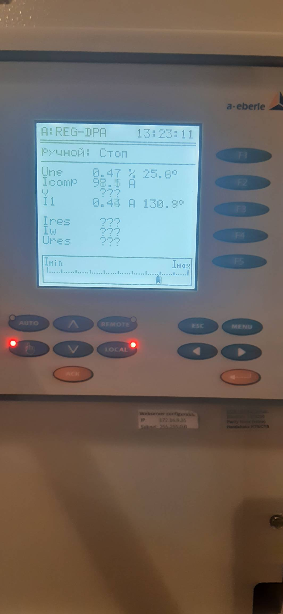
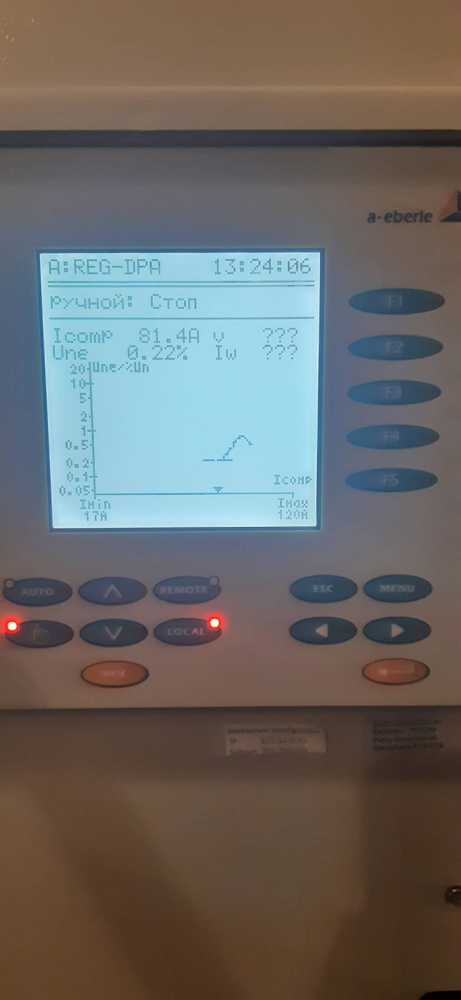

ПС Технологическая 
===================================================================================

ДГК 2с 10кВ
-----------

Оборудование ДГК состоит из катушки ДГК (распологаемой на ОРУ) и шкафа автоматики (распологаемым в ОПУ панель № 31).

Данные для настройки ДГК в резонанс мультиконтроллер получает с сигнальной обмотки ДГК U0.
Для отоброжения световой индикации замыкания на землю (ОРУ 110кВ РДГК) измерения 3U0 производится с ТН-2с 10кВ .

Автоматика ДГК 2с.10кВ выполнена на базе мультиконтроллера :ref:`REG-DP`.
 
**Описание интерфейса шкафа управления**

.. image:: media/image7.jpeg

* защитная дверь;
* индикаторы уровня масла;
* индикатор сигнализации режима ОЗЗ;
* амперметр для индикации тока компенсации ДГР;
* индикатор сигнализации "Авария привода" неисправности привода ДГР;
* индикаторы температуры масла;
* переключатель режимов ручной/автоматический;
* индикаторы сигнализации крайних положений плунжера ДГР;
* кнопки ручного управления привода ДГР.

Питание шкафа автоматики REG-DPA осуществляется через автоматический выключатель SF1 (ОПУ панель №31).
Питание привода ДГК осуществлякется  через автоматический выключатель SF1 (ОРУ шкаф ДГК2с10кВ).

Перевод в ручной или в автоматический режим осуществляется как ключем управления режимами SAC1 (Ручн/Авт) так и клавишами на лицевой стороне мультиконтроллера(hend/auto).

Управление с панели мультиконтроллера:

Нажав клавишу hend (переведя автоматику в ручной режим), управление реактором производится клавишами обозначенными стрелками (вверх/вниз)тем самым увеличивая ток ДГК или уменьшая его. 
Положение ключа SAC1 в этом случае необходимо перевести в автоматический.

Управление с лицевой стороны шкафа автоматики:

При переводе ключа SAC1 в ручной режим, осуществляется блокировка ручного управление с панели мультиконтроллера и управление реактором возможно только с лицевой стороны шкафа автоматики. 
Переведя ключ управления с автоматического режима в ручной, управление реактором осуществляется кнопками SB1 "Уменьшение тока" и SB2 "Увеличение тока".
При достижении крайнего верхнего положения загорается лампа "Максимальный ток", при достижении крайнего нижнего положения загорается лампа "Минимальный ток".

Для настройки ДГК в режим резонанса в ручном режиме управлиния настройка производится по показаниям Une(текущее значение напряжения U0) для этого необходимо прогнать ДГК во всем диапазоне регулирования и оставить на максимальном значении Une.

Сигнализация:

Блинкер KH1-отключен автоматический выключатель SF1.

Коммутационные аппараты (шкаф автоматики в ОПУ П.31):

Автоматический выключатель SF1- питаение шкафа автоматики;
Автоматический выключатель SF2- сервисные цепи.

Коммутационные аппараты (шкаф ДГК 2с10кВ ОРУ):

Автоматический выключатель SF1-питание привода ДГК;
Автоматический выключатель SF2-обогрев шкафа;
Автоматический выключатель SF3-обогрев привода;
Автоматический выключатель SF4-питание регулятора температуры;

САОН 
-----

На подстанции 750кВ «Белорусская» предусмотрена выдача команд в автоматику разгрузки при аварийном отключении генераторов на Белорусской АЭС, которая предназначена для восстановления баланса режима работы ОЭС Беларуси. В качестве управляющих команд предусмотрено использование четырех очередей отключения нагрузки (ОН1-ОН4) и включения отключенной нагрузки (ВОН). Работа ВЧ канала связи осуществляется по схеме «точка (передатчик (прд)) — многоточка (приёмники (прм))». Передача 5-ти команд ПА выполняется последовательно. Принятые команды действуют на отключение и включение нагрузки, подключенной к данной автоматике.

Автоматика САОН (Специальная автоматика отключения нагрузки) состоит из аппаратуры приёма данных и команд :ref:`АПДКЦ-01 «Стрела-М»` и схемы автоматики на базе электромеханических реле. Так же в комплекс САОН входит шкаф выходных реле - команд отключения и включения присоединений. Аппаратура вышеназванных устройств размещена в ОПУ шкафах №26 и 27.

Передача команд на ПС Новая, ПС Билево, ПС Технологическая, ПС Витебск-Северная с ПС 330кВ Витебск предусматривается по ВЧ каналу связи, по проводам ВЛ-110кВ на участке: 

- ПС 330кВ Витебск (прд) — ПС Новая (прм), ПС Билево (прм) (ВЧ обход), ПС Технологическая (прм), ПС Витебск-Северная (прм) (канал № 222а, фаза В, частота передачи/приёма 692-696кГц).

.. image:: media/САОН/Технологическая1.png
   :width: 2.2in
   :height: 4.0in

Рисунок 1 – Лицевая сторона шкафов САОН

Специальная автоматика отключения нагрузки (САОН) 
......................................................

В логике схемы автоматики сигнал отключения соответствующей очереди нагрузки формируется при одновременном наличии сигнала ОН1-ОН4 и контрольного сигнала ВОН. Состояние выходного сигнала ОН1-ОН4 сохраняется при исчезновении оперативного тока. Запоминание реализовано использованием двухпозиционных реле. 

Отключение нагрузки от САОН реализовано подачей постоянного сигнала отключения (срабатывание выходных реле) в цепи управления коммутационных аппаратов нагрузки.

Включение нагрузки может происходить оперативным персоналом или при приёме длительной команды ВОН. Для включения автоматика САОН на ПС 750кВ "Белорусская" отправляет команду ВОН длительностью 60 с. На подстанции контролируется длительность сигнала ВОН, отсутствие приёма сигналов отключения нагрузки и сработанное состояние выходных двухпозиционных реле. Производится включение очередей нагрузки, через заданную уставкой выдержку времени.

Включение нагрузки, отключенной от САОН, осуществляется снятием длительного выходного сигнала отключения (возвратом двухпозиционных реле) и подачей импульсной команды включения в цепи управления выключателя присоединения.

Включение нагрузки оперативным персоналом запрещается на 120 секунд после приёма команд отключения нагрузки.

- **Источник оперативного тока:** 
	- Шкаф САОН - ШУ от ЩПТ;
	- Отключение/включение присоединений - ШУ присоединения.

- **Действует:** Отключение/включение присоединений в соответствии с таблицей уставок :ref:`ДАРН-САОН`

Аппаратура передачи данных и команд релейных защит и противоаварийной автоматики цифровая :ref:`АПДКЦ-01 «Стрела-М»` 
.........................................................................................................................

:ref:`АПДКЦ-01 «Стрела-М»` предназначена для организации канала приёма сигналов команд релейных защит и противоаварийной автоматики (РЗ и ПА) и их комбинаций по высокочастотному каналу.

В/ч канал образован по фазе "В" ВЛ-110кВ №1 "Витебск 330 – Витебск Северная". На ПС Билево организован ВЧ обход между ВЛ-110кВ №1 "Витебск 330 – Витебск Северная" на Витебск 330 и ВЛ-110кВ №1 "Витебск 330 – Витебск Северная" на Витебск Северную. Состоит из в/ч заградителей, конденсаторов связи с фильтрами присоединений.

Передатчик :ref:`АПДКЦ-01 «Стрела-М»` на ПС 330кВ Витебск в режиме ожидания непрерывно выдает в ВЧ-канал контрольный сигнал (КС). КС постоянно обрабатывается приёмниками на ПС Новая, ПС Билево, ПС Технологическая, ПС Витебск-Северная. В случае неудовлетворительного качества принимаемого сигнала (отношение сигнал/помеха или уровень сигнала) формируется сигнал неисправности. 

При приёме ВЧ команды:

- мгновенно срабатывает выходное реле соответствующее принятой команде. Создаётся запись в журнале событий;

- схема автоматики принимает и обрабатывает команду;

- срабатывает сигнализация;

- проходит телесигнал «Работа САОН».

Список сигнализации
.....................

**ОПУ:**

**Шкаф №26 САОН:** 

.. list-table:: Сигнализация
   :class: longtable
   :widths: 10 20 20
   :header-rows: 1

   * - Обозначение
     - Наименование
     - Значение
   * - Блинкер КН1
     - Отключение нагрузки от IV очереди САОН
     - Срабатывание выходного реле IV очереди
   * - Блинкер КН2
     - Отключение нагрузки от III очереди САОН
     - Срабатывание выходного реле III очереди
   * - Блинкер КН3
     - Отключение нагрузки от II очереди САОН
     - Срабатывание выходного реле II очереди
   * - Блинкер КН4
     - Отключение нагрузки от I очереди САОН
     - Срабатывание выходного реле I очереди
   * - Блинкер КН5
     - Команда включения отключенной нагрузки
     - Приём команды ВОН
   * - Блинкер КН6
     - Общая авария
     - 1. Внутренняя неисправность АПДКЦ-01 «Стрела-М»;	2. Нет, либо низкий уровень контрольного сигнала;
   * - Блинкер КН7
     - Снижение уровня ВЧ входа
     - 1. Ошибка шины АПДКЦ-01 «Стрела-М»; 2. Отсутствует контрольный сигнал;
   * - Блинкер КН8
     - Подтверждение приёма команды
     - Приём ВЧ команды
   * - Блинкер КН9
     - Обрыв цепей опертока АПДКЦ
     - 1. Неисправность цепей опертока АПДКЦ; 2. Отключен автомат SF16 в шкафу № 29
   * - Блинкер КН10
     - Работа или неисправность САОН
     - Выпал блинкер КН1-5, 8
   * - Блинкер КН11
     - Обрыв цепей опертока выходных реле САОН
     - 1. Неисправность цепей опертока выходных реле САОН; 2. Отключен автомат SF6 в шкафу № 29
   * - Светодиод HL1
     - Блинкер не поднят
     - Выпал блинкер КН1-10 в шкафу № 26
   * - Светодиод HG1
     - Блинкер не поднят
     - Выпал блинкер КН11 в шкафу № 27

.. list-table:: :ref:`АПДКЦ-01 «Стрела-М»` **блок БСД:** (индикация активна только в момент срабатывания)
   :class: longtable
   :widths: 10 30
   :header-rows: 1

   * - Индикатор
     - Значение
   * - РАБ
     - Нормальная работа блока
   * - Выход 1
     - Передача команды ОН-1 в схему автоматики
   * - Выход 2
     - Передача команды ОН-2 в схему автоматики
   * - Выход 3
     - Передача команды ОН-3 в схему автоматики
   * - Выход 4
     - Передача команды ОН-4 в схему автоматики
   * - Выход 5
     - Передача команды ВОН в схему автоматики

.. list-table:: :ref:`АПДКЦ-01 «Стрела-М»` **блок БЦОС:**
   :class: longtable
   :widths: 10 25
   :header-rows: 1

   * - Индикатор
     - Значение
   * - РАБ
     - Нормальная работа блока
   * - ПРМ
     - Приём ВЧ команды

.. list-table:: :ref:`АПДКЦ-01 «Стрела-М»` **блок управления:** журнал событий
   :class: longtable
   :widths: 10 15
   :header-rows: 1

   * - Принимаемая команда
     - Значение
   * - С1
     - ОН-4 (отключение нагрузки 4 очереди)
   * - С2
     - ОН-3 (отключение нагрузки 3 очереди)
   * - С3
     - ОН-2 (отключение нагрузки 2 очереди)
   * - С4
     - ОН-1 (отключение нагрузки 1 очереди)
   * - С5
     - ВОН (включение отключённой нагрузки)

Список телесигналов 
......................

**ОПУ: Шкаф №26 САОН:** 

- "Неисправность САОН" - Неисправность схемы автоматики и/или :ref:`АПДКЦ-01 «Стрела-М»`

- "Работа САОН" - Срабатывание схемы автоматики и/или :ref:`АПДКЦ-01 «Стрела-М»`

Список переключающих устройств
.................................

**ОПУ: Шкаф №26 САОН:** 

.. list-table:: Переключатели
   :class: longtable
   :widths: 10 20 15 20
   :header-rows: 1

   * - Переключатель
     - Наименование
     - Возможное положение
     - Назначение
   * - Накладка SX1
     - ОН от IV очереди САОН
     - Влево - «Выведено», **Вправо - «Введено»**
     - Ввод-вывод действия выходных цепей
   * - Накладка SX2
     - ОН от III очереди САОН
     - Влево - «Выведено», **Вправо - «Введено»**
     - Ввод-вывод действия выходных цепей
   * - Накладка SX3
     - ОН от II очереди САОН
     - Влево - «Выведено», **Вправо - «Введено»**
     - Ввод-вывод действия выходных цепей
   * - Накладка SX4
     - ОН от I очереди САОН
     - Влево - «Выведено», **Вправо - «Введено»**
     - Ввод-вывод действия выходных цепей
   * - Накладка SX5
     - ВОН IV очереди САОН
     - Влево - «Выведено», **Вправо - «Введено»**
     - Ввод-вывод действия выходных цепей
   * - Накладка SX6
     - ВОН III очереди САОН
     - Влево - «Выведено», **Вправо - «Введено»**
     - Ввод-вывод действия выходных цепей
   * - Накладка SX7
     - ВОН II очереди САОН
     - Влево - «Выведено», **Вправо - «Введено»**
     - Ввод-вывод действия выходных цепей
   * - Накладка SX8
     - ВОН I очереди САОН
     - Влево - «Выведено», **Вправо - «Введено»**
     - Ввод-вывод действия выходных цепей
   * - Кнопка SB1
     - Включение отключённой нагрузки IV очереди САОН
     - -
     - Возврат выходных реле очереди
   * - Кнопка SB2
     - Включение отключённой нагрузки III очереди САОН
     - -
     - Возврат выходных реле очереди
   * - Кнопка SB3
     - Включение отключённой нагрузки II очереди САОН
     - -
     - Возврат выходных реле очереди
   * - Кнопка SB4
     - Включение отключённой нагрузки I очереди САОН
     - -
     - Возврат выходных реле очереди

**ОПУ: Шкаф №27 Выходные реле САОН:** 

.. table:: **Переключатели**

    +-------------+--------------+-------------+----------------+----------------+
    |Переключатель| Наименование | Возможное   | Нормальное     | Назначение     |
    |             |              | положение   | положение      |                |
    +=============+==============+=============+================+================+
    | накладка    | Отключение   | Влево -     | В              | Ввод-вывод     |
    | SX10        | КЛ-529       | «Выведено», | соответствии   | действия       |
    +-------------+--------------+ Вправо -    + с таблицей     + выходных реле  +
    | накладка    | Отключение   | «Введено»   | уставок        | в цепи	 |
    | SX11        | КЛ-533       |             |:ref:`ДАРН-САОН`| управление     |
    +-------------+--------------+             +                + присоединения  +
    | накладка    | Отключение   |             |                |     		 |
    | SX12        | КЛ 5с и 6с   |             |                |     		 |
    | 	          | от ОН-4      |             |                |     		 |
    +-------------+--------------+             +                +     		 +
    | накладка    | Отключение   |             |                |     		 |
    | SX13        | КЛ-539       |             |                |     		 |
    +-------------+--------------+             +                +     		 +
    | накладка    | Отключение   |             |                |     		 |
    | SX14        | КЛ-546       |             |                |     		 |
    +-------------+--------------+             +                +     		 +
    | накладка    | Отключение   |             |                |     		 |
    | SX15        | КЛ-551       |             |                |     		 |
    +-------------+--------------+             +                +     		 +
    | накладка    | Отключение   |             |                |     		 |
    | SX16        | КЛ-508       |             |                |     		 |
    +-------------+--------------+             +                +     		 +
    | накладка    | Отключение   |             |                |     		 |
    | SX17        | КЛ-541       |             |                |     		 |
    +-------------+--------------+             +                +     		 +
    | накладка    | Отключение   |             |                |     		 |
    | SX19        | КЛ-537       |             |                |     		 |
    +-------------+--------------+             +                +     		 +
    | накладка    | Отключение   |             |                |     		 |
    | SX20        | КЛ-520       |             |                |     		 |
    +-------------+--------------+             +                +     		 +
    | накладка    | Отключение   |             |                |     		 |
    | SX21        | КЛ-519       |             |                |     		 |
    +-------------+--------------+             +                +     		 +
    | накладка    | Отключение   |             |                |     		 |
    | SX22        | КЛ-530       |             |                |     		 |
    +-------------+--------------+             +                +     		 +
    | накладка    | Отключение   |             |                |     		 |
    | SX23        | КЛ-531       |             |                |     		 |
    +-------------+--------------+             +                +     		 +
    | накладка    | Отключение   |             |                |     		 |
    | SX24        | КЛ-532       |             |                |     		 |
    +-------------+--------------+             +                +     		 +
    | накладка    | Отключение   |             |                |     		 |
    | SX25        | КЛ-542       |             |                |     		 |
    +-------------+--------------+             +                +     		 +
    | накладка    | Отключение   |             |                |     		 |
    | SX26        | КЛ-543       |             |                |     		 |
    +-------------+--------------+             +                +     		 +
    | накладка    | Отключение   |             |                |     		 |
    | SX27        | КЛ-545       |             |                |     		 |
    +-------------+--------------+             +                +     		 +
    | накладка    | Отключение   |             |                |     		 |
    | SX28        | КЛ 5 и 6с    |             |                |     		 |
    |             | от ОН-3      |             |                |     		 |
    +-------------+--------------+             +                +     		 +
    | накладка    | Отключение   |             |                |     		 |
    | SX29        | КЛ-528       |             |                |     		 |
    +-------------+--------------+             +                +     		 +
    | накладка    | Отключение   |             |                |     		 |
    | SX30        | КЛ-502       |             |                |     		 |
    +-------------+--------------+             +                +     		 +
    | накладка    | Отключение   |             |                |     		 |
    | SX31        | КЛ-506       |             |                |     		 |
    +-------------+--------------+             +                +     		 +
    | накладка    | Отключение   |             |                |     		 |
    | SX33        | КЛ-504       |             |                |     		 |
    +-------------+--------------+             +                +     		 +
    | накладка    | Отключение   |             |                |     		 |
    | SX34        | КЛ-509       |             |                |     		 |
    +-------------+--------------+             +                +     		 +
    | накладка    | Отключение   |             |                |     		 |
    | SX35        | КЛ-512       |             |                |     		 |
    +-------------+--------------+             +                +     		 +
    | накладка    | Отключение   |             |                |     		 |
    | SX36        | КЛ-514       |             |                |     		 |
    +-------------+--------------+             +                +     		 +
    | накладка    | Отключение   |             |                |     		 |
    | SX37        | КЛ-515       |             |                |     		 |
    +-------------+--------------+             +                +     		 +
    | накладка    | Отключение   |             |                |     		 |
    | SX38        | КЛ-518       |             |                |     		 |
    +-------------+--------------+             +                +     		 +
    | накладка    | Отключение   |             |                |     		 |
    | SX40        | КЛ-536       |             |                |     		 |
    +-------------+--------------+             +                +     		 +
    | накладка    | Отключение   |             |                |     		 |
    | SX41        | КЛ-540       |             |                |     		 |
    +-------------+--------------+             +                +     		 +
    | накладка    | Отключение   |             |                |     		 |
    | SX42        | КЛ-538       |             |                |     		 |
    +-------------+--------------+             +                +     		 +
    | накладка    | Отключение   |             |                |     		 |
    | SX43        | КЛ-534       |             |                |     		 |
    +-------------+--------------+             +                +     		 +
    | накладка    | Отключение   |             |                |     		 |
    | SX45        | КЛ-501       |             |                |     		 |
    +-------------+--------------+             +                +     		 +
    | накладка    | Отключение   |             |                |     		 |
    | SX46        | КЛ-505       |             |                |     		 |
    +-------------+--------------+             +                +     		 +
    | накладка    | Отключение   |             |                |     		 |
    | SX47        | КЛ-507       |             |                |     		 |
    +-------------+--------------+             +                +     		 +
    | накладка    | Отключение   |             |                |     		 |
    | SX48        | КЛ-510       |             |                |     		 |
    +-------------+--------------+             +                +     		 +
    | накладка    | Отключение   |             |                |     		 |
    | SX49        | КЛ-526       |             |                |     		 |
    +-------------+--------------+             +                +     		 +
    | накладка    | Отключение   |             |                |     		 |
    | SX50        | КЛ-535       |             |                |     		 |
    +-------------+--------------+             +                +     		 +
    | накладка    | Отключение   |             |                |     		 |
    | SX52        | КЛ-517       |             |                |     		 |
    +-------------+--------------+             +                +     		 +
    | накладка    | Отключение   |             |                |     		 |
    | SX53        | КЛ-513       |             |                |     		 |
    +-------------+--------------+             +                +     		 +
    | накладка    | Отключение   |             |                |     		 |
    | SX54        | КЛ-511       |             |                |     		 |
    +-------------+--------------+             +                +     		 +
    | накладка    | Отключение   |             |                |     		 |
    | SX55        | КЛ-503       |             |                |     		 |
    +-------------+--------------+             +                +     		 +
    | накладка    | Отключение   |             |                |     		 |
    | SX56        | КЛ-524       |             |                |     		 |
    +-------------+--------------+             +                +     		 +
    | накладка    | Отключение   |             |                |     		 |
    | SX64        | ВЛ-35кВ на   |             |                |     		 |
    |             | Осётки       |             |                |     		 |
    +-------------+--------------+-------------+----------------+----------------+

Список коммутационной аппаратуры
...................................

**ОПУ: Шкаф №29 ЩПТ:** 

- Автомат SF16 "ШУ АПДКЦ" - Питание и защита цепей АПДКЦ-01 «Стрела-М». **Включен**

- Автомат SF6 "ШУ САОН" - Питание и защита схемы автоматики и выходных реле. **Включен**

**ОПУ: Шкаф №26 САОН:** :ref:`АПДКЦ-01 «Стрела-М»` **блок управления:**

- Выключатель "ПИТАНИЕ" - Питание устройства **Включен**

Указания оперативному персоналу
-----------------------------------

1. Ввод в работу САОН производится в следующей последовательности:

- ОПУ шкаф № 29 ЩПТ проверить включенное положение автоматических выключателей: SF51 - "ШУ АПДКЦ" и SF52 - "ШУ САОН";

- ОПУ панель № 26 АПДКЦ-01 «Стрела-М»: проверить включенное положение выключателя «ПИТАНИЕ» на блоке управления;

- ОПУ панель № 26 АПДКЦ-01 «Стрела-М»: проверить состояние индикаторов РАБ на блоках БСД и БЦОС, и отсутствие сигнализации приёма/передачи команд;

- ОПУ панель № 26 нажать кнопки: SB1, SB2, SB3, SB4;

- ОПУ панель № 26 перевести в правое положение "Введено" накладки: SX1 - SX12;

- ОПУ панель № 26 проверить соответствие накладок SX9 - SX64 с режимной таблицей переключающих устройств и таблицей уставок.

2. Вывод из работы САОН производится в следующей последовательности:  
  
- ОПУ панель № 26 перевести в правое положение "Выведено" накладки: SX1 - SX12.

3. При работе сигнализации неисправности устройств САОН оперативный персонал должен:

- определить и записать: время поступления и вид неисправности (по журналу событий, сигнализации), кратковременная или постоянно действующая неисправность, после чего сбросить сигнализацию кнопкой "Сигнализ. сброс" на приёмнике :ref:`АПДКЦ-01 «Стрела-М»` в панели №26;    

- если неисправность постоянно действующая, вывести САОН из работы.

4. При аварийном отключении автоматического выключателя оперативного тока - включить его, при повторном отключении вывести САОН из работы.

5. При работе САОН и приёме команд ПРМ :ref:`АПДКЦ-01 «Стрела-М»` оперативный персонал должен:

- по индикаторам на блоке БСД :ref:`АПДКЦ-01 «Стрела-М»` и по журналу событий записать номера принятых команд, время приёма;

- по указательным реле определить номера сработавших очередей САОН;

- доложить вышестоящему оперативному звену; 

- сквитировать сигнализацию.

6. Иметь ввиду, что при установленных переносных заземлениях на участке ВЛ-110кВ №1 "Витебск 330 – Витебск Северная" от ПС Билево в сторону ПС В.Северная и ПС Технологическая, ВЧ-канал САОН на ПС В.Северная и ПС Технологическая работать не будет, а при установленных переносных заземлениях на участке от ПС Билево в сторону ПС Витебск 330 и ПС Новая, ВЧ-канал САОН работать не будет полностью.