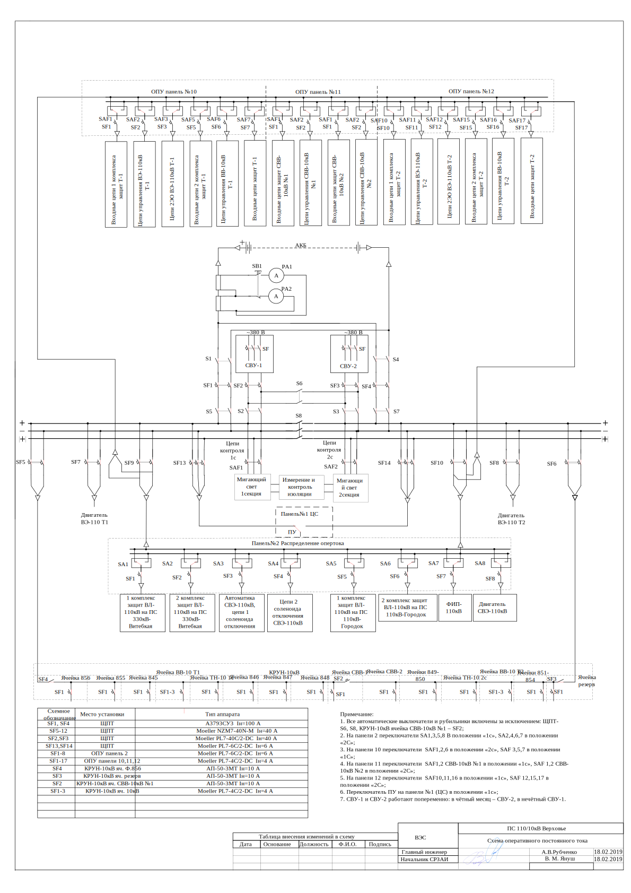
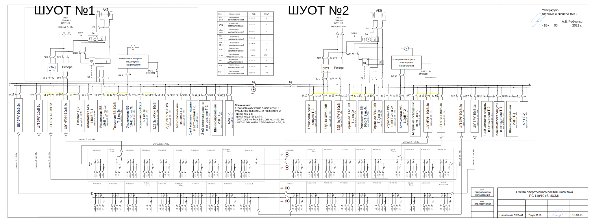
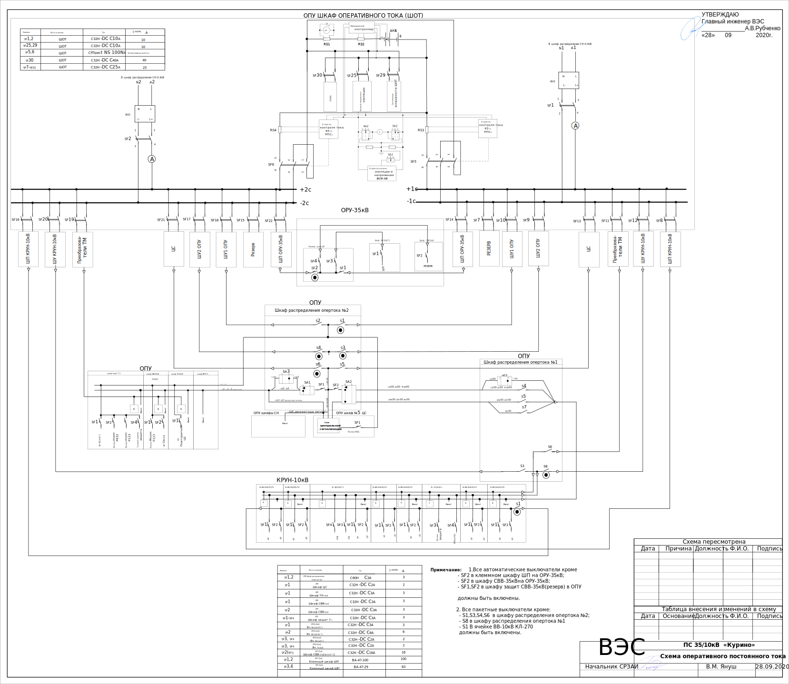
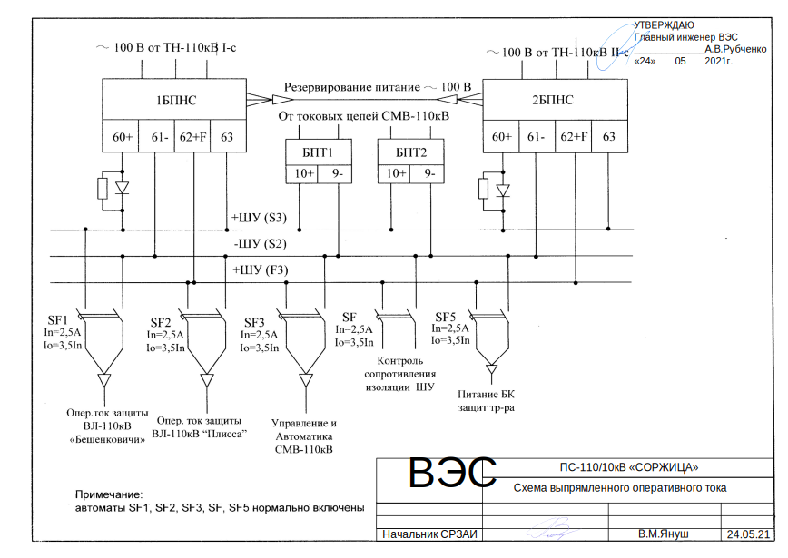
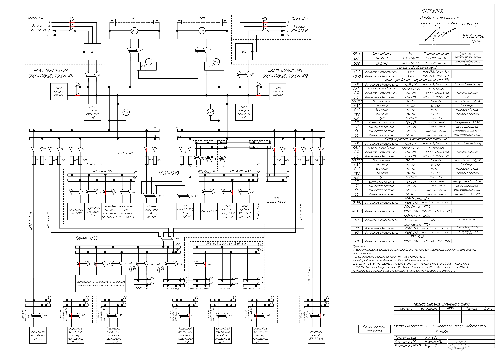

Схемы распределения постоянного опертока
========================================
ПС 110кВ Билево
~~~~~~~~~~~~~~~

.. figure:: _static/Билево-оперток.svg
       :align: center

ПС Верховье
~~~~~~~~~~~~~~~~~

ПС КСМ
~~~~~~~~~~~~~~~~~

ПС Курино
~~~~~~~~~~~~~~~~~

ПС Городок
~~~~~~~~~~~~~~~~

.. figure:: _static/Городок-оперток.svg
       :align: center

ПС Соржица
~~~~~~~~~~~~~~~~

ПС Шумилино
~~~~~~~~~~~~~~~~~~

.. figure:: _static/Шумилино-оперток.svg
       :align: center

ПС Руба
~~~~~~~~~~~~~~~~~~

