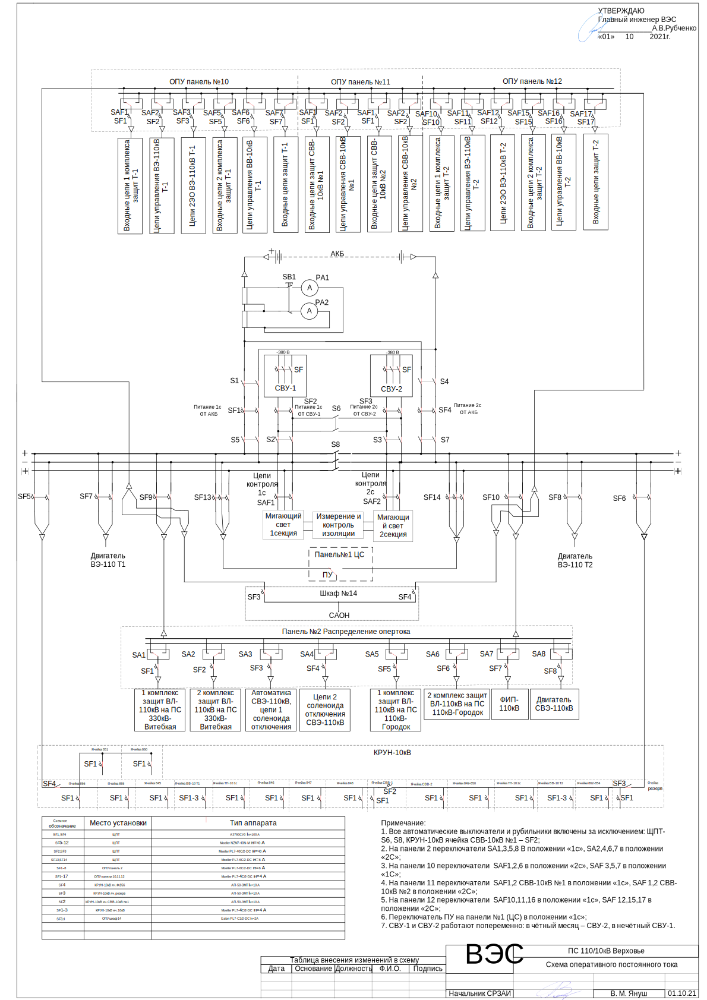

Схемы распределения постоянного опертока
========================================
ПС 110кВ Билево
~~~~~~~~~~~~~~~

.. figure:: _static/Билево-оперток.svg
       :align: center

ПС 110кВ Верховье
~~~~~~~~~~~~~~~~~

ПС 110кВ КСМ
~~~~~~~~~~~~~~~~~

.. figure:: _static/КСМ-оперток.svg
       :align: center

ПС 35кВ Курино
~~~~~~~~~~~~~~~~~

.. figure:: _static/Курино-оперток.svg
       :align: center

ПС 110кВ Городок
~~~~~~~~~~~~~~~~

.. figure:: _static/Городок-оперток.svg
       :align: center

ПС 110кВ Соржица
~~~~~~~~~~~~~~~~

.. figure:: _static/Соржица-оперток.svg
       :align: center

ПС 110кВ Шумилино
~~~~~~~~~~~~~~~~~~

.. figure:: _static/Шумилино-оперток.svg
       :align: center
