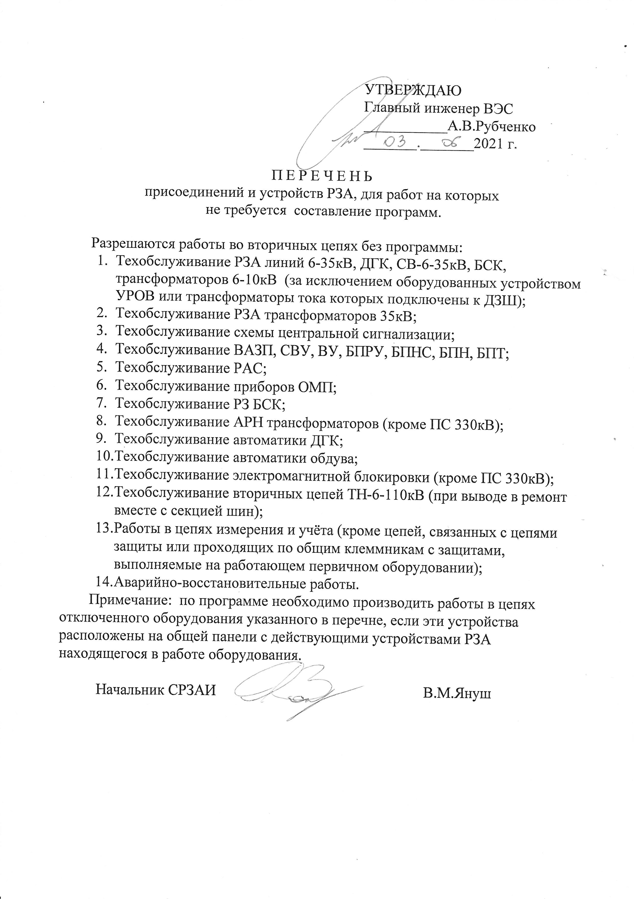

Перечни по РЗА
===============

Перечень работников СРЗАИ ВЭС, допущенных к самостоятельной проверке устройств РЗА
~~~~~~~~~~~~~~~~~~~~~~~~~~~~~~~~~~~~~~~~~~~~~~~~~~~~~~~~~~~~~~~~~~~~~~~~~~~~~~~~~~~

РЗА и ПА ВЛ-330кВ №348 и 349, АТ-330кВ, шин 330кВ, УРОВ-330кВ
"""""""""""""""""""""""""""""""""""""""""""""""""""""""""""""

Атрошкин Е.Л., Януш В.М.

РЗА и ПА ВЛ-110кВ без ВЧБ
"""""""""""""""""""""""""

Атрошкин Е.Л., Януш В.М., Тымуль М.И., Чернов И.О.

РЗА и ПА ВЛ-110кВ с ВЧБ
"""""""""""""""""""""""

Атрошкин Е.Л., Януш В.М., Тымуль М.И.

РЗА ВЛ-110кВ на REL 670
"""""""""""""""""""""""

Атрошкин Е.Л., Януш В.М., Тымуль М.И., Чернов И.О.

ДЗШ-110кВ, УРОВ-110кВ
"""""""""""""""""""""

Атрошкин Е.Л., Януш В.М., Тымуль М.И., Чернов И.О.

Приборы ОМП, РАС
""""""""""""""""

Атрошкин Е.Л., Януш В.М., Тымуль М.И., Войтик С.А., Петрачков И.Э., Поляков А.В.

Электромагнитная блокировка 110, 330кВ
""""""""""""""""""""""""""""""""""""""

Атрошкин Е.Л., Януш В.М., Тымуль М.И., Войтик С.А., Хуртов Д.И., Беспалов А.В., Быков М.К., Литвинович Е.А., Саулич С.П., Петрачков И.Э., Поляков А.В., Пашкевич А.А., Чернов И.О., Булай О.В.

Регулирование напряжения 10, 110кВ на ПС 330кВ Витебская
""""""""""""""""""""""""""""""""""""""""""""""""""""""""

Атрошкин Е.Л., Януш В.М., Тымуль М.И., Петрачков И.Э.

Регулирование напряжения трансформаторов 35-110кВ
"""""""""""""""""""""""""""""""""""""""""""""""""

Атрошкин Е.Л., Януш В.М., Тымуль М.И., Войтик С.А., Саулич С.П., Петрачков И.Э., Поляков А.В., Метла С.Л.

ЩПТ, ВУ, ШУОТ
"""""""""""""

Атрошкин Е.Л., Януш В.М., Тымуль М.И., Войтик С.А., Саулич С.П., Поляков А.В.

ЩСН
"""

Атрошкин Е.Л., Януш В.М., Тымуль М.И., Чернов И.О., Войтик С.А., Саулич С.П., Поляков А.В., Петрачков И.Э.

Схема синхронизации ВЛ-110кВ
""""""""""""""""""""""""""""

Атрошкин Е.Л., Януш В.М., Тымуль М.И., Чернов И.О.

Аппаратура ТН-6-35кВ
""""""""""""""""""""

Атрошкин Е.Л., Януш В.М., Тымуль М.И., Чернов И.О., Булай О.В., Войтик С.А., Хуртов Д.И., Беспалов А.В., Быков М.К., Литвинович Е.А., Пашкевич А.А., Саулич С.П., Петрачков И.Э., Поляков А.В., Метла С.Л.

РЗА СВВ-10кВ
""""""""""""

Атрошкин Е.Л., Януш В.М., Тымуль М.И., Петрачков И.Э.

Аппаратура ТН-110кВ
"""""""""""""""""""

Атрошкин Е.Л., Януш В.М., Тымуль М.И., Чернов И.О., Войтик С.А., Хуртов Д.И., Беспалов А.В., Саулич С.П., Быков М.К., Булай О.В., Поляков А.В.

Аппаратура ТН-330кВ
"""""""""""""""""""

Атрошкин Е.Л., Януш В.М., Тымуль М.И.

Управление Р-110-330кВ
""""""""""""""""""""""

Атрошкин Е.Л., Януш В.М., Тымуль М.И., Быков М.К., Саулич С.П., Петрачков И.Э.

Центральная сигнализация
""""""""""""""""""""""""

Атрошкин Е.Л., Януш В.М., Тымуль М.И., Чернов И.О., Войтик С.А., Хуртов Д.И., Беспалов А.В., Саулич С.П., Быков М.К., Булай О.В., Петрачков И.Э., Поляков А.В.

РЗА трансформаторов 35-110кВ на базе электромеханических реле
"""""""""""""""""""""""""""""""""""""""""""""""""""""""""""""

Януш В.М., Атрошкин Е.Л., Тымуль М.И., Войтик С.А., Хуртов Д.И., Беспалов А.В.

РЗА трансформаторов 35-110кВ на базе микропроцессорных реле
"""""""""""""""""""""""""""""""""""""""""""""""""""""""""""

Атрошкин Е.Л., Януш В.М.

Делительная автоматика СВ-110кВ
"""""""""""""""""""""""""""""""

Януш В.М., Атрошкин Е.Л., Тымуль М.И., Чернов И.О., Войтик С.А., Саулич С.П., Поляков А.В., Петрачков И.Э.

РЗА КВЛ-6-35кВ, СВ-6-35кВ на базе микропроцессорных реле
""""""""""""""""""""""""""""""""""""""""""""""""""""""""

Атрошкин Е.Л., Януш В.М., Тымуль М.И., Чернов И.О., Войтик С.А., Хуртов Д.И., Беспалов А.В., Саулич С.П., Быков М.К., Булай О.В., Петрачков И.Э.

РЗА КВЛ-6-35кВ, СВ 6-35кВ на базе электромеханических реле
""""""""""""""""""""""""""""""""""""""""""""""""""""""""""

Атрошкин Е.Л., Януш В.М., Тымуль М.И., Чернов И.О., Войтик С.А., Хуртов Д.И., Беспалов А.В., Саулич С.П., Быков М.К., Булай О.В., Петрачков И.Э., Поляков А.В.

Автоматика ДГК
""""""""""""""

Януш В.М., Тымуль М.И., Метла С.Л.

Цепи и приборы учёта электроэнергии, измерительные приборы
""""""""""""""""""""""""""""""""""""""""""""""""""""""""""

Атрошкин Е.Л., Януш В.М., Тымуль М.И., Чернов И.О., Войтик С.А., Хуртов Д.И., Беспалов А.В., Саулич С.П., Быков М.К., Булай О.В., Петрачков И.Э., Поляков А.В., Фёдоров А.Г.

Автоматика дизель-генератора базы ВЭС
"""""""""""""""""""""""""""""""""""""

Януш В.М., Тымуль М.И.

АЧР, ДАРН
"""""""""

БПРУ, БПТ
"""""""""

ДЗШ-10кВ
""""""""

ЗДЗ-6-10кВ
""""""""""

РЗА гидрогенератора ДГЭС, БСК
"""""""""""""""""""""""""""""

РЗА гидрогенератора ВГЭС
""""""""""""""""""""""""

УЗГ-УЗГК
""""""""

РЗ  РЗН
"""""""

Перечень инструкций для рабочего места диспетчера ОДС
~~~~~~~~~~~~~~~~~~~~~~~~~~~~~~~~~~~~~~~~~~~~~~~~~~~~~~

.. 0-Инструкция;1-РЗА;2-Объект;3-Дата ввода в действие;4-Дата пересмотра;5-ЦДС;6-ОДС;7-ПС 330;8-ВГЭС;9-ВГРЭС;10-ВСРЭС;11-БРЭС;12-ШРЭС;13-РРЭС;14-ЛРЭС;15-ГРЭС

.. csv-filter:: 
   :header-rows: 1
   :included_cols: 0, 1, 2, 3, 4
   :file: Инструкции.csv
   :delim: ;
   :include: {6: 'ИСТИНА'}

Перечень инструкций для рабочего места диспетчера ВСРЭС
~~~~~~~~~~~~~~~~~~~~~~~~~~~~~~~~~~~~~~~~~~~~~~~~~~~~~~~

.. csv-filter:: 
   :header-rows: 1
   :included_cols: 0, 1, 2, 3, 4
   :file: Инструкции.csv
   :delim: ;
   :include: {10: 'ИСТИНА'}

Перечень присоединений и устройств РЗА, для работ на которых не требуется  составление программ (документация инженера ОДС)
~~~~~~~~~~~~~~~~~~~~~~~~~~~~~~~~~~~~~~~~~~~~~~~~~~~~~~~~~~~~~~~~~~~~~~~~~~~~~~~~~~~~~~~~~~~~~~~~~~~~~~~~~~~~~~~~~~~~~~~~~~~~

.. согласно ТНПА не требуется выдавать оперативному персоналу но Ершов попросил для инженера ОДС

Перечень устройств релейной защиты ПС 330кВ «Витебская», которые необходимо выводить на время операций с испытательными блоками в токовых цепях этих устройств (документация ПС 330кВ "Витебска")
~~~~~~~~~~~~~~~~~~~~~~~~~~~~~~~~~~~~~~~~~~~~~~~~~~~~~~~~~~~~~~~~~~~~~~~~~~~~~~~~~~~~~~~~~~~~~~~~~~~~~~~~~~~~~~~~~~~~~~~~~~~~~~~~~~~~~~~~~~~~~~~~~~~~~~~~~~~~~~~~~~~~~~~~~~~~~~~~~~~~~~~~~~~~~~~~~

.. СТП 33243.353600-16 п.5.2.21 и 5.3.9

.. figure:: _static/1.jpg
       :scale: 25 %
       :align: center

Перечень мероприятий при отключении быстродействующих защит на ПС 330кВ «Витебская» (документация ПС 330кВ "Витебска")
~~~~~~~~~~~~~~~~~~~~~~~~~~~~~~~~~~~~~~~~~~~~~~~~~~~~~~~~~~~~~~~~~~~~~~~~~~~~~~~~~~~~~~~~~~~~~~~~~~~~~~~~~~~~~~~~~~~~~~

.. СТП 33243.353600-16 п.5.3.11 и СТП 09110.35.520-07 п.12.8

.. figure:: _static/2.jpg
       :scale: 25 %
       :align: center

Перечень нормально отключенных устройств РЗА на ПС 330кВ «Витебская» (документация ПС 330кВ "Витебска")
~~~~~~~~~~~~~~~~~~~~~~~~~~~~~~~~~~~~~~~~~~~~~~~~~~~~~~~~~~~~~~~~~~~~~~~~~~~~~~~~~~~~~~~~~~~~~~~~~~~~~~~

.. СТП 33243.353600-16 п.5.3.10

.. figure:: _static/3.jpg
       :scale: 25 %
       :align: center

Перечень автотрансформаторов, резервные защиты которых должны оперативно ускоряться при необходимости вывода дистанционной защиты средней стороны автотрансформатора на ПС 330кВ «Витебская» (документация ПС 330кВ "Витебска")
~~~~~~~~~~~~~~~~~~~~~~~~~~~~~~~~~~~~~~~~~~~~~~~~~~~~~~~~~~~~~~~~~~~~~~~~~~~~~~~~~~~~~~~~~~~~~~~~~~~~~~~~~~~~~~~~~~~~~~~~~~~~~~~~~~~~~~~~~~~~~~~~~~~~~~~~~~~~~~~~~~~~~~~~~~~~~~~~~~~~~~~~~~~~~~~~~~~~~~~~~~~~~~~~~~~~~~~~~~~~~~~~~~~~~~~

.. figure:: _static/4.jpg
       :scale: 25 %
       :align: center