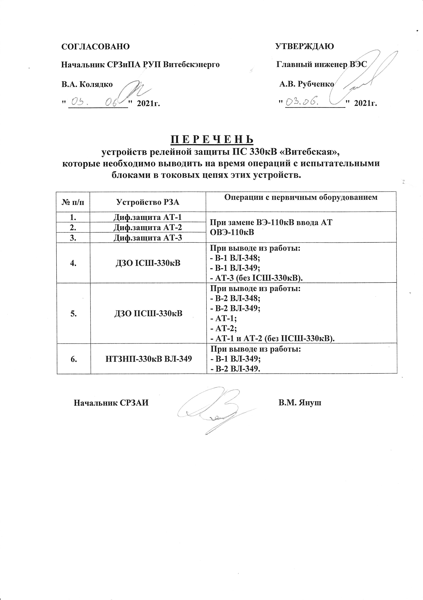
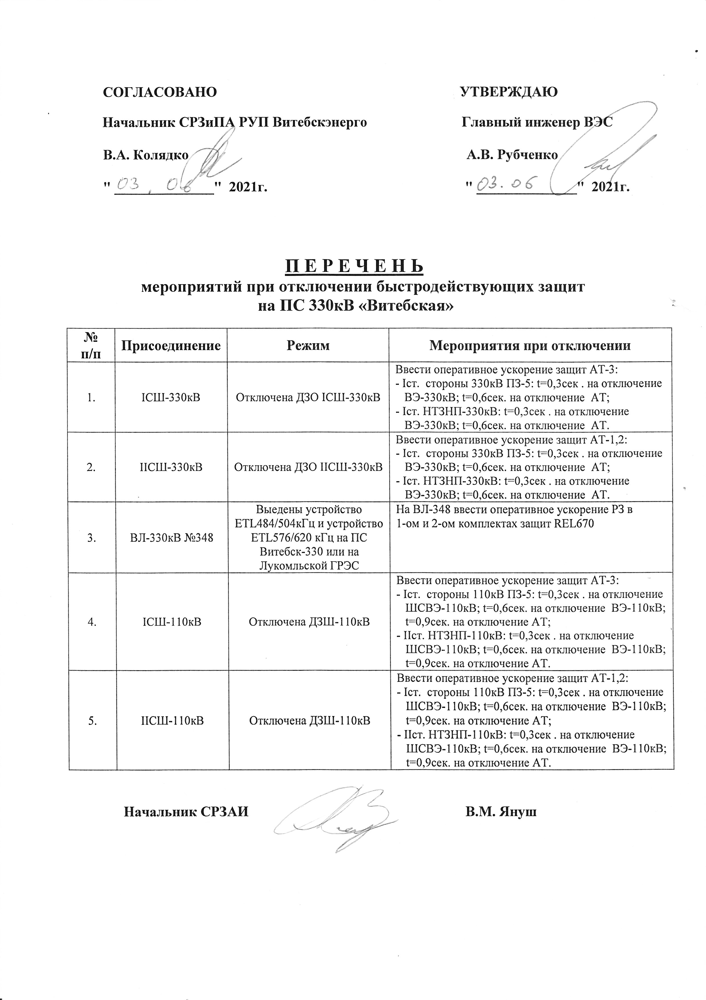
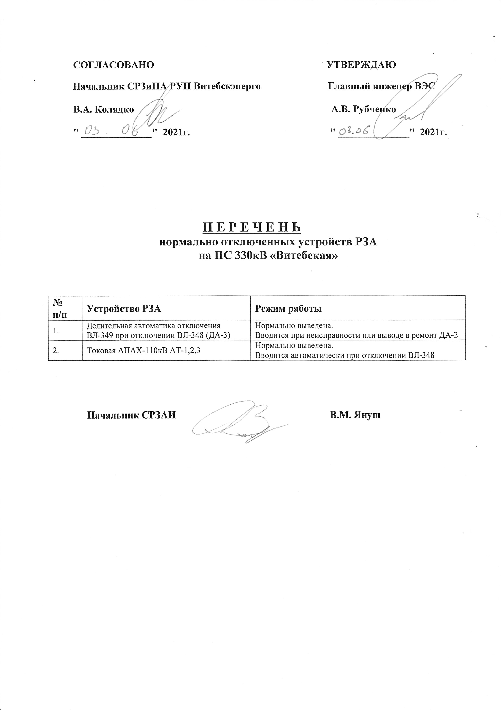
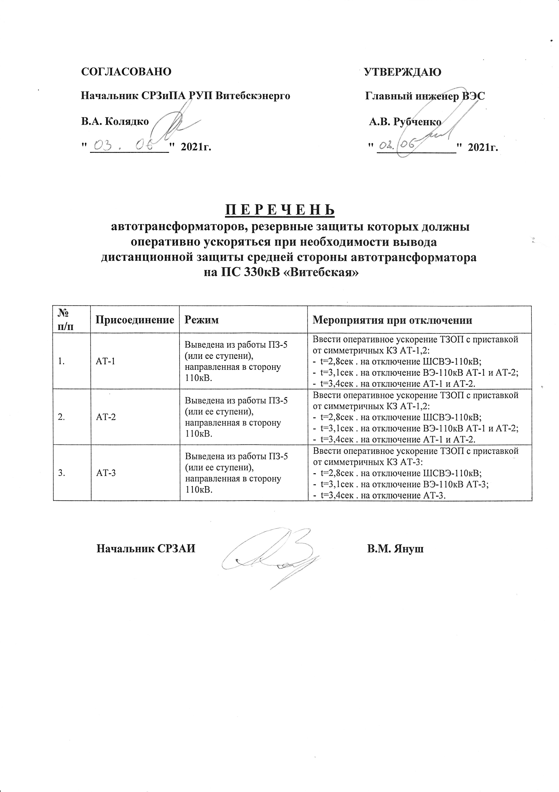

Перечни по РЗА
===============

Перечень устройств релейной защиты ПС 330кВ «Витебская», которые необходимо выводить на время операций с испытательными блоками в токовых цепях этих устройств (документация ПС 330кВ "Витебска")
~~~~~~~~~~~~~~~~~~~~~~~~~~~~~~~~~~~~~~~~~~~~~~~~~~~~~~~~~~~~~~~~~~~~~~~~~~~~~~~~~~~~~~~~~~~~~~~~~~~~~~~~~~~~~~~~~~~~~~~~~~~~~~~~~~~~~~~~~~~~~~~~~~~~~~~~~~~~~~~~~~~~~~~~~~~~~~~~~~~~~~~~~~~~~~~~~

.. СТП 33243.353600-16 п.5.2.21 и 5.3.9

Перечень мероприятий при отключении быстродействующих защит на ПС 330кВ «Витебская» (документация ПС 330кВ "Витебска")
~~~~~~~~~~~~~~~~~~~~~~~~~~~~~~~~~~~~~~~~~~~~~~~~~~~~~~~~~~~~~~~~~~~~~~~~~~~~~~~~~~~~~~~~~~~~~~~~~~~~~~~~~~~~~~~~~~~~~~

.. СТП 33243.353600-16 п.5.3.11 и СТП 09110.35.520-07 п.12.8

Перечень нормально отключенных устройств РЗА на ПС 330кВ «Витебская» (документация ПС 330кВ "Витебска")
~~~~~~~~~~~~~~~~~~~~~~~~~~~~~~~~~~~~~~~~~~~~~~~~~~~~~~~~~~~~~~~~~~~~~~~~~~~~~~~~~~~~~~~~~~~~~~~~~~~~~~~

.. СТП 33243.353600-16 п.5.3.10

Перечень автотрансформаторов, резервные защиты которых должны оперативно ускоряться при необходимости вывода дистанционной защиты средней стороны автотрансформатора на ПС 330кВ «Витебская» (документация ПС 330кВ "Витебска")
~~~~~~~~~~~~~~~~~~~~~~~~~~~~~~~~~~~~~~~~~~~~~~~~~~~~~~~~~~~~~~~~~~~~~~~~~~~~~~~~~~~~~~~~~~~~~~~~~~~~~~~~~~~~~~~~~~~~~~~~~~~~~~~~~~~~~~~~~~~~~~~~~~~~~~~~~~~~~~~~~~~~~~~~~~~~~~~~~~~~~~~~~~~~~~~~~~~~~~~~~~~~~~~~~~~~~~~~~~~~~~~~~~~~~~~

